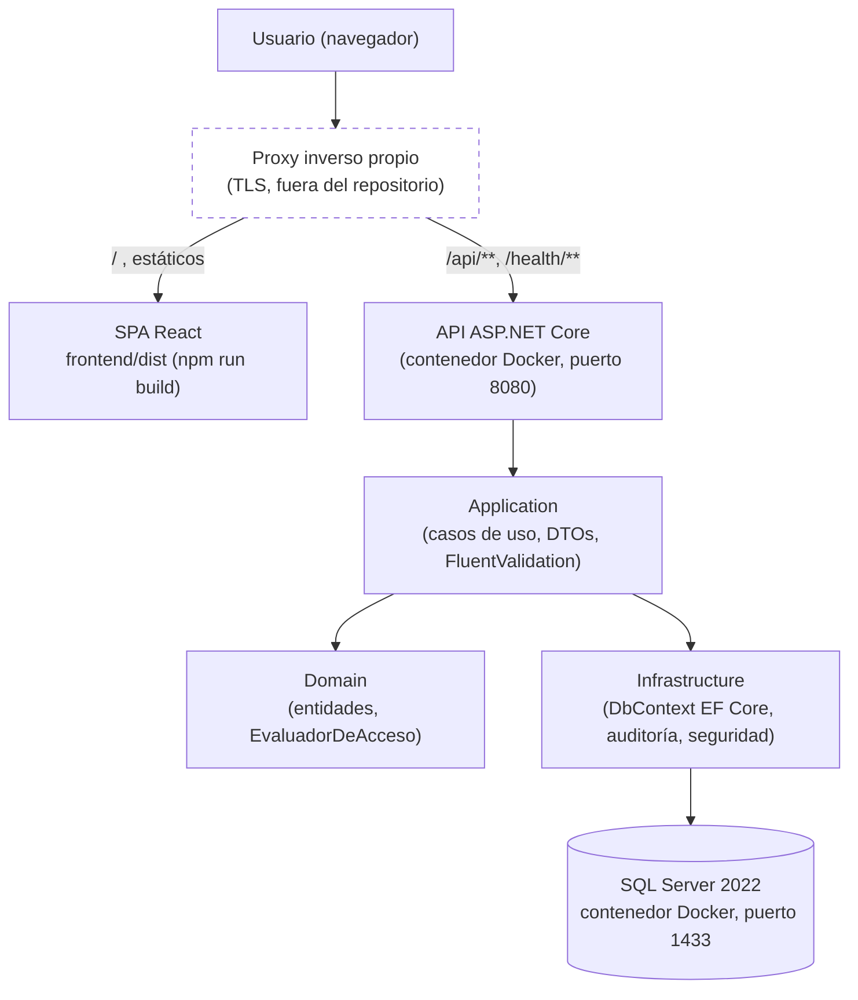
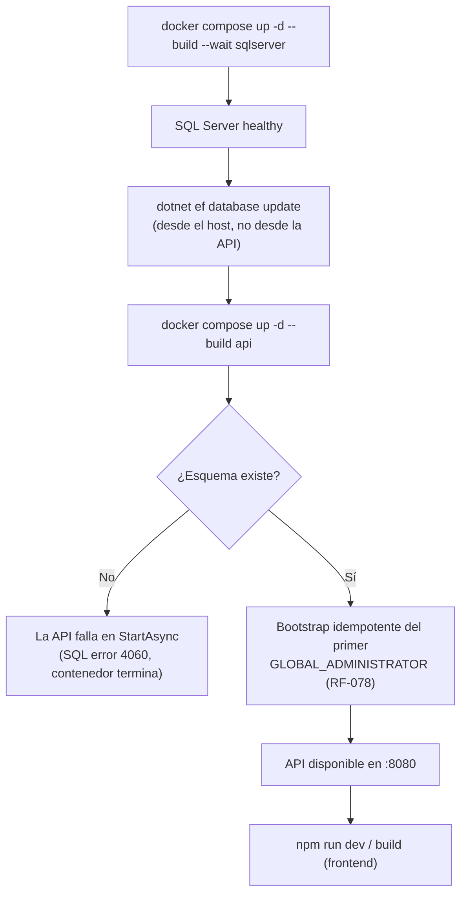

# Manual de Despliegue e Implementación

**Proyecto**: Enterprise Access Control Platform
**Estado del proyecto**: **CERRADO** (Baseline T001–T242 + validación funcional post-Baseline T243–T312, hallazgos VF-001 a VF-011 en `CLOSED`)
**Versión de este manual**: 1.0 — 2026-09-26
**Fuente de verdad verificada**: [`README.md`](../../README.md), [`docker-compose.yml`](../../docker-compose.yml), [`docker-compose.prod.yml`](../../docker-compose.prod.yml), [`backend/Dockerfile`](../../backend/Dockerfile), `appsettings*.json`, migraciones EF Core, [`specs/001-control-acceso-empresarial/quickstart.md`](../../specs/001-control-acceso-empresarial/quickstart.md)

> Este manual documenta cómo desplegar la solución **tal como existe en el repositorio cerrado**. No propone
> cambios de infraestructura ni una nueva etapa: es un manual de entrega, no un plan de trabajo.

---

## 1. Objetivo

Este manual explica cómo levantar Enterprise Access Control en un **entorno de desarrollo/demostración local**
(Docker Compose) y qué exige el **despliegue de producción** documentado en el propio repositorio
(`docker-compose.prod.yml`). Está dirigido a quien deba instalar, verificar o reproducir el sistema sin haber
participado en su construcción.

## 2. Alcance

**Incluido en este manual** (verificado contra el repositorio):

- Despliegue local de desarrollo con `docker-compose.yml` (SQL Server + API contenedorizada).
- Despliegue de producción con `docker-compose.prod.yml` (mismo par de servicios, sin secretos por defecto).
- Aplicación de migraciones EF Core y arranque del primer administrador (bootstrap, RF-078).
- Construcción y publicación de la SPA (`npm run build`) y su integración detrás de un proxy inverso propio.
- Verificación post-despliegue y troubleshooting basado en comportamientos reales observados/documentados.

**Fuera del alcance de este manual** (y del proyecto cerrado):

- Integración continua: no existe `.github/workflows` en el repositorio.
- Imagen o servicio de Docker Compose para la SPA: **no existe**; el repositorio solo contenedoriza la API.
- Orquestación en Kubernetes, escalado horizontal, balanceo de carga o alta disponibilidad: no documentados.
- Proveedor de identidad externo, mensajería, colas o caché distribuido: decisión arquitectónica explícita de
  no incorporarlos mientras ningún requisito lo justifique (constitución, Reglas de Arquitectura e Ingeniería).
- Configuración concreta del proxy inverso (nginx, Caddy, IIS, etc.): el repositorio exige su existencia pero
  no publica su configuración. **[NO DOCUMENTADO EN EL REPOSITORIO]**

## 3. Arquitectura de despliegue



Notas verificadas:

- **Solo la API está contenedorizada.** El repositorio no define imagen ni servicio de Compose para la SPA
  (`backend/Dockerfile` es el único Dockerfile del repositorio).
- La API no configura CORS: la SPA debe consumirla en el **mismo origen**, lo que exige un proxy inverso que
  sirva ambos (estáticos de `frontend/dist/` y `/api/`, `/health/`) bajo el mismo host.
- El proxy inverso es una pieza **requerida pero no incluida**: su configuración concreta no forma parte del
  repositorio. Ver [Diagrama de despliegue](diagrams/despliegue.md) para el detalle de contenedores.

## 4. Componentes de la solución

| Componente | Rol | Evidencia |
|---|---|---|
| Frontend (SPA React) | Interfaz de usuario, sin lógica de autorización (Principio I) | `frontend/src/` |
| API ASP.NET Core (`net10.0`) | Controladores, JWT, `ProblemDetails`, health checks | `backend/src/EnterpriseAccessControl.Api` |
| Application | Casos de uso, DTOs, validación (FluentValidation vía `ValidacionAutomaticaFilter`) | `backend/src/EnterpriseAccessControl.Application` |
| Domain | Entidades, enums, `EvaluadorDeAcceso` (motor de 15 pasos) | `backend/src/EnterpriseAccessControl.Domain` |
| Infrastructure | `DbContext` EF Core, migraciones, interceptor de auditoría, seguridad (hash de contraseñas, reloj empresarial) | `backend/src/EnterpriseAccessControl.Infrastructure` |
| SQL Server 2022 | Motor de persistencia; también aloja los 6 triggers de no-solapamiento | Imagen oficial `mcr.microsoft.com/mssql/server:2022-latest` |
| EF Core 10 + provider SQL Server | ORM y mecanismo de migraciones de esquema | `Directory.Build.props`, `*.csproj` |
| NodaTime 3.3.4 | Zona horaria IANA por Compañía Principal (RF-080) | `backend/src/.../Infrastructure` (reloj empresarial) |
| JWT (`Microsoft.AspNetCore.Authentication.JwtBearer` 10.0.12) | Autenticación por portador, `ClockSkew = 0` | `Program.cs` |
| OpenAPI (`Microsoft.AspNetCore.OpenApi`, nativo) | Documento `/openapi/v1.json`, **solo en `Development`** | `Program.cs` (`MapOpenApi().AllowAnonymous()` dentro de `IsDevelopment()`) |
| Docker / Docker Compose v2 | Empaquetado y orquestación local de SQL Server + API | `docker-compose.yml`, `docker-compose.prod.yml`, `backend/Dockerfile` |

## 5. Requisitos de infraestructura

### Requisitos verificados (versiones probadas según README)

| Elemento | Versión verificada | Fuente |
|---|---|---|
| .NET SDK | 10.0.401 (`net10.0`, C# 13, `LangVersion 13.0`) | README, `Directory.Build.props` |
| Node.js | 20+ (probado con 24.15.0) | README |
| npm | 11.12.1 | README |
| Docker | 29.8 (Docker Desktop o motor compatible) | README |
| `dotnet-ef` | Herramienta global (`dotnet tool install --global dotnet-ef`) | README |
| SQL Server (imagen) | `mcr.microsoft.com/mssql/server:2022-latest` | `docker-compose*.yml` |
| Imagen runtime de la API | `mcr.microsoft.com/dotnet/aspnet:10.0` (Debian, no *chiseled*: `Microsoft.Data.SqlClient` requiere ICU) | `backend/Dockerfile` |
| Imagen build de la API | `mcr.microsoft.com/dotnet/sdk:10.0` | `backend/Dockerfile` |

### Requisitos mínimos / recomendados de hardware, sistema operativo y navegador

**[NO DOCUMENTADO EN EL REPOSITORIO].** No existe ningún archivo que declare CPU, RAM, almacenamiento mínimo/
recomendado, sistema operativo del host de desarrollo, ni una matriz de navegadores soportados. `ux-ui.md`
declara **WCAG 2.2 AA** como objetivo de accesibilidad, pero no fija navegadores concretos. Para el host de
producción sí existe un requisito explícito: **Linux** con Docker Compose v2 (README, sección "Despliegue").

| Categoría | Estado |
|---|---|
| CPU / RAM / almacenamiento (desarrollo) | [POR COMPLETAR] |
| CPU / RAM / almacenamiento (producción) | [POR COMPLETAR] |
| Sistema operativo del host de desarrollo | No restringido explícitamente (Docker Desktop multiplataforma) |
| Sistema operativo del host de producción | **Linux** (requisito explícito, README §Despliegue) |
| Navegadores soportados | [NO DOCUMENTADO EN EL REPOSITORIO] |
| Puertos | Ver tabla de la sección 8 |

## 6. Requisitos previos

- Acceso al repositorio (`https://github.com/DavidSanchezR/enterprise-access-control`, rama `main`).
- Docker / Docker Compose v2 instalado y en ejecución.
- .NET 10 SDK y herramienta `dotnet-ef` instalados en el host que ejecute las migraciones (la API **no** las
  aplica por sí sola).
- Node.js 20+ y npm, si se va a compilar/servir la SPA.
- Puertos `1433` (SQL Server) y `8080` (API) disponibles en desarrollo; en producción ambos se publican
  **solo en `127.0.0.1`** (ver §8).
- Variable `BOOTSTRAP_ADMIN_PASSWORD` definida **antes** del primer arranque (obligatoria; sin valor por
  defecto ni siquiera en desarrollo — ver §7 y §10).

## 7. Configuración de variables de entorno

Variables verificadas directamente en `docker-compose.yml`, `docker-compose.prod.yml`, `appsettings.json` y
`appsettings.Development.json`. Ninguna contraseña real se incluye aquí; todos los valores de ejemplo son
placeholders o los valores de desarrollo local ya versionados en el propio repositorio (no secretos de
producción).

### Backend — API

| Variable | Componente | Obligatoria | Descripción | Ejemplo | Sensible |
|---|---|---|---|---|---|
| `ASPNETCORE_ENVIRONMENT` | API | No (default `Development` en compose de desarrollo; `Production` fijo en el compose de producción) | Entorno de ejecución de ASP.NET Core | `Development` / `Production` | No |
| `ConnectionStrings__SqlServer` | API | Sí | Cadena de conexión a SQL Server | `Server=sqlserver,1433;Database=EnterpriseAccessControl;User Id=sa;Password=***;TrustServerCertificate=True;Encrypt=True` | **Sí** |
| `Jwt__SigningKey` | API | Sí | Clave de firma JWT, mínimo 32 caracteres | `<clave-aleatoria-min-32-chars>` | **Sí** |
| `Jwt__Issuer` | API | No (default `enterprise-access-control`) | Emisor del token | `enterprise-access-control` | No |
| `Jwt__Audience` | API | No (default `enterprise-access-control-spa`) | Audiencia del token | `enterprise-access-control-spa` | No |
| `Jwt__AccessTokenMinutos` | API | No (default `60`) | Minutos de vigencia del access token | `60` | No |
| `Bootstrap__AdminEmail` | API | Sí (con default de conveniencia solo en desarrollo) | Correo del primer `GLOBAL_ADMINISTRATOR` (RF-078) | `administrator@eac.local` | No |
| `Bootstrap__AdminPassword` | API | **Sí, sin default en ningún entorno** | Contraseña inicial del primer administrador; debe cumplir la política de contraseñas vigente | `<elige-una-contraseña-segura>` | **Sí — nunca se versiona** |
| `ZonaHoraria__TimeZoneId` | API | No (default `America/Lima`) | Zona IANA global de respaldo (RF-080) cuando un registro no es resoluble a una Compañía Principal | `America/Lima` | No |
| `PasswordPolicy__LongitudMinima` | API | No (default `10`) | Longitud mínima de contraseña | `10` | No |
| `PasswordPolicy__RequiereMayuscula` | API | No (default `true`) | Exige mayúscula | `true` | No |
| `PasswordPolicy__RequiereMinuscula` | API | No (default `true`) | Exige minúscula | `true` | No |
| `PasswordPolicy__RequiereDigito` | API | No (default `true`) | Exige dígito | `true` | No |
| `PasswordPolicy__IntentosFallidosParaBloqueo` | API | No (default `5`) | Intentos fallidos antes de `BLOQUEADO` | `5` | No |
| `PasswordPolicy__DiasExpiracion` | API | No (default `90`) | Días antes de exigir cambio de contraseña | `90` | No |
| `PasswordPolicy__HistorialNoReutilizable` | API | No (default `5`) | Contraseñas previas no reutilizables | `5` | No |

### SQL Server

| Variable | Componente | Obligatoria | Descripción | Ejemplo | Sensible |
|---|---|---|---|---|---|
| `MSSQL_SA_PASSWORD` | SQL Server | Sí (desarrollo tiene default `Dev-Password1!`; producción **no tiene default**) | Contraseña de la cuenta `sa` | `<contraseña-fuerte>` | **Sí** |
| `MSSQL_PID` | SQL Server | Solo en producción (`Developer` fijo en desarrollo) | Edición licenciada de SQL Server (`Developer` no se admite en producción) | `Standard` | No |
| `MSSQL_DATABASE` | API (cadena de conexión, solo desarrollo/E2E) | No (default `EnterpriseAccessControl`) | Nombre de la base de datos objetivo | `EnterpriseAccessControl` / `EnterpriseAccessControl_E2E` | No |
| `MSSQL_HOST_PORT` | SQL Server (producción) | No (default `1433`) | Puerto local publicado para SQL Server | `1433` | No |

### Producción — específicas de `docker-compose.prod.yml` (sin valor por defecto)

| Variable | Obligatoria | Descripción | Sensible |
|---|---|---|---|
| `SQLSERVER_CONNECTION_STRING` | Sí | Cadena de conexión completa que usará la API | **Sí** |
| `JWT_SIGNING_KEY` | Sí | Clave de firma (≥32 caracteres) | **Sí** |
| `BOOTSTRAP_ADMIN_EMAIL` | Sí | Correo del administrador inicial | No |
| `BOOTSTRAP_ADMIN_PASSWORD` | Sí | Contraseña del administrador inicial | **Sí** |
| `API_PORT` | No (default `8080`) | Puerto local publicado para la API | No |
| `JWT_ISSUER`, `JWT_AUDIENCE`, `JWT_ACCESS_TOKEN_MINUTOS`, `ZONA_HORARIA_TIME_ZONE_ID`, `PASSWORD_*` | No | Ídem a la tabla de la API, con prefijo de entorno | No |

### Frontend

| Variable | Componente | Obligatoria | Descripción | Ejemplo | Sensible |
|---|---|---|---|---|---|
| `VITE_API_PROXY_TARGET` | Vite dev server | No (default `http://localhost:5290`, el perfil de `dotnet run`) | Destino del proxy `/api` y `/health` del servidor de desarrollo | `http://localhost:8080` (API en Docker) | No |
| `VITE_API_BASE_URL` | Vite dev server | No (sin definir = mismo origen) | Solo si la SPA debe llamar a una API en **otro** origen (requiere CORS, no configurado hoy) | *(vacío)* | No |
| `E2E_BASE_URL` | Playwright | No (default `http://localhost:5173`) | URL base de la SPA para E2E | `http://localhost:5173` | No |
| `E2E_API_URL` | Playwright | No (default `http://localhost:8080`) | URL base de la API para E2E | `http://localhost:8080` | No |

> **IMPORTANTE.** Ningún valor de este manual es una contraseña real de producción. Los valores de
> `docker-compose.yml` (`Dev-Password1!`, la clave JWT de desarrollo) están versionados en el propio
> repositorio y **son solo para desarrollo local**; nunca deben reutilizarse en producción.

## 8. Configuración Docker

### Servicios (desarrollo — `docker-compose.yml`)

| Servicio | Imagen | Puerto publicado | Healthcheck | Volumen |
|---|---|---|---|---|
| `sqlserver` (contenedor `eac-sqlserver`) | `mcr.microsoft.com/mssql/server:2022-latest` | `1433:1433` | `sqlcmd … SELECT 1`, cada 10s, 10 reintentos, `start_period` 30s | `eac-sqlserver-data:/var/opt/mssql` |
| `api` (contenedor `eac-api`) | build local (`backend/Dockerfile`) | `${API_PORT:-8080}:8080` | Ninguno declarado en Compose (la API expone `/health/live` y `/health/ready`, invocables manualmente o desde el proxy) | Ninguno (sin estado) |

`api` depende de `sqlserver` con `condition: service_healthy`: Compose no intentará levantar la API hasta que
el healthcheck de SQL Server pase.

### Servicios (producción — `docker-compose.prod.yml`)

Mismos dos servicios, con diferencias explícitas:

- **Sin secretos por defecto**: toda variable obligatoria usa la sintaxis `${VAR:?mensaje}` — Compose se
  niega a arrancar si falta.
- **Puertos publicados solo en `127.0.0.1`** (`127.0.0.1:${MSSQL_HOST_PORT:-1433}:1433` y
  `127.0.0.1:${API_PORT:-8080}:8080`): ni SQL Server ni la API son alcanzables desde fuera del host; el
  tráfico externo entra únicamente por el proxy inverso.
- `restart: unless-stopped` en ambos servicios.
- `MSSQL_PID` sin valor por defecto: la edición Developer no está permitida en producción.

### Dockerfile de la API (`backend/Dockerfile`)

```mermaid
flowchart LR
    A["FROM mcr.microsoft.com/dotnet/sdk:10.0 AS build"] --> B["COPY .editorconfig, Directory.Build.props"]
    B --> C["COPY *.csproj (todas las capas) + dotnet restore"]
    C --> D["COPY src/ + dotnet publish -c Release -o /app"]
    D --> E["FROM mcr.microsoft.com/dotnet/aspnet:10.0 AS runtime"]
    E --> F["COPY --from=build /app"]
    F --> G["ENV ASPNETCORE_HTTP_PORTS=8080 · EXPOSE 8080"]
    G --> H["USER $APP_UID (sin privilegios)"]
    H --> I["ENTRYPOINT dotnet EnterpriseAccessControl.Api.dll"]
```



Puntos verificados:

- El **contexto de construcción es la raíz del repositorio**, no `backend/`, para compartir
  `.editorconfig` y `Directory.Build.props` (con `TreatWarningsAsErrors`) entre el build de Docker y el build
  local — evita que ambos produzcan binarios distintos.
- La imagen runtime es `aspnet:10.0` (Debian), **no** la variante *chiseled*, porque
  `Microsoft.Data.SqlClient` necesita ICU (`InvariantGlobalization=false`).
- El contenedor corre con usuario sin privilegios (`$APP_UID`, provisto por la imagen oficial).
- **No existe Dockerfile para la SPA.**

### Flujo de arranque real



**La API no aplica migraciones al arrancar, ni en desarrollo ni en producción.** Su rutina de arranque
consulta la base de datos durante `StartAsync`; si el esquema no existe, el proceso falla explícitamente en
lugar de quedar en un estado degradado. **El orden importa: migrar siempre antes de levantar la API.**

## 9. Instalación paso a paso (entorno de desarrollo/demo)

Procedimiento verificado contra el README y `quickstart.md`, reproducible por otra persona:

1. **Obtener el código**: clonar `https://github.com/DavidSanchezR/enterprise-access-control` y ubicarse en
   la rama `main`.
2. **Configurar variables**: crear un archivo `.env` junto a `docker-compose.yml` (excluido por
   `.gitignore`, leído automáticamente por Docker Compose):
   ```bash
   echo 'BOOTSTRAP_ADMIN_PASSWORD=<elige-una-contraseña-que-cumpla-la-política>' > .env
   ```
3. **Validar prerrequisitos**: `docker --version`, `dotnet --version` (10.x), `dotnet ef --version`,
   `node --version` (20+).
4. **Levantar SQL Server** y esperar a que esté sano:
   ```bash
   docker compose up -d --build --wait sqlserver
   ```
5. **Aplicar el esquema** (migraciones + seed de catálogos maestros de Perú) desde el host, usando la cadena
   de `appsettings.Development.json` (`localhost,1433`):
   ```bash
   dotnet ef database update \
     --project backend/src/EnterpriseAccessControl.Infrastructure \
     --startup-project backend/src/EnterpriseAccessControl.Api
   ```
6. **Levantar la API**:
   ```bash
   docker compose up -d --build api
   ```
7. **Verificar health**:
   ```bash
   curl -s -o /dev/null -w '%{http_code}\n' http://localhost:8080/health/ready   # 200 esperado
   ```
8. **Verificar la base de datos**: confirmar que el esquema y el seed de catálogos (`TipoDocumento`,
   `TipoSangre`, `Género`, …) existen (por ejemplo, con `sqlcmd` o cualquier cliente de SQL Server contra
   `localhost,1433`).
9. **Verificar la API**: en `Development`, el documento OpenAPI está disponible en
   `http://localhost:8080/openapi/v1.json` (anónimo, solo en este entorno).
10. **Preparar y levantar el frontend**:
    ```bash
    cd frontend
    cp .env.example .env   # y definir VITE_API_PROXY_TARGET=http://localhost:8080
    npm install
    npm run dev             # http://localhost:5173
    ```
11. **Validar acceso inicial**: iniciar sesión con `Bootstrap__AdminEmail` (por defecto,
    `administrator@eac.local` en desarrollo) y la contraseña definida en `BOOTSTRAP_ADMIN_PASSWORD`; el
    sistema debe forzar el cambio de contraseña en el primer login (RF-078).
12. **Ejecutar pruebas/smoke tests** (opcional pero recomendado): ver §12 y la sección de pruebas de
    [`04-documentacion-tecnica-cierre.md`](04-documentacion-tecnica-cierre.md).

> **Advertencia verificada.** Si `VITE_API_PROXY_TARGET` no se configura, el proxy de Vite apunta por
> defecto a `http://localhost:5290` (el perfil de `dotnet run`), donde no hay nada escuchando si la API se
> levantó con Docker. El síntoma es un `502` en `/api/**` que la SPA traduce como "Correo o contraseña
> incorrectos" — indistinguible a simple vista de un error de credenciales. La pista:
> `Usuario.IntentosFallidosConsecutivos` no se incrementa en la base de datos, porque la petición nunca llegó
> a la API.

## 10. Base de datos

| Concepto | Detalle verificado |
|---|---|
| Motor | SQL Server 2022 (`mcr.microsoft.com/mssql/server:2022-latest`) |
| Base de datos de desarrollo | `EnterpriseAccessControl` (configurable con `MSSQL_DATABASE`) |
| Base de datos de E2E | `EnterpriseAccessControl_E2E` (dedicada, recreada por la preparación global de Playwright) |
| Cadena de conexión (desarrollo) | `Server=localhost,1433;Database=EnterpriseAccessControl;User Id=sa;Password=Dev-Password1!;TrustServerCertificate=True;Encrypt=True` (`appsettings.Development.json`) |
| Cadena de conexión (contenedor→contenedor) | `Server=sqlserver,1433;...` (nombre del servicio de Compose, no `localhost`) |
| Persistencia | Volumen Docker nombrado (`eac-sqlserver-data` en desarrollo, `sqlserver-data` en producción) |

**Diferenciación explícita de conceptos** (ninguno se aplica automáticamente al arrancar la API):

1. **Creación de la base**: la implica la primera migración (`InicialFoundational`), aplicada manualmente
   con `dotnet ef database update`.
2. **Migraciones**: 12 migraciones de esquema versionadas (ver §11) — deben aplicarse explícitamente.
3. **Seed de catálogos maestros**: una migración adicional (`SeedMaestrosPeru`, carpeta `Migrations/Seed/`)
   inserta los catálogos versionados de Perú (RF-031): tipos de documento (DNI, Carné de Extranjería,
   Pasaporte, RUC), tipos de sangre (8 valores) y géneros (2 valores). Se aplica en el mismo comando
   `dotnet ef database update`, porque EF Core la trata como una migración más.
4. **Bootstrap del administrador inicial**: **no es una migración ni un seed de EF Core**. Es una rutina de
   arranque de la API (`StartAsync`, RF-078) que crea el primer `GLOBAL_ADMINISTRATOR` **solo si no existe
   ninguno**, leyendo `Bootstrap__AdminEmail`/`Bootstrap__AdminPassword`. Es idempotente: reiniciar la API no
   crea un segundo administrador. La API **no arranca** sin ambas variables definidas.

## 11. Migraciones

| Ítem | Detalle |
|---|---|
| Ubicación | `backend/src/EnterpriseAccessControl.Infrastructure/Persistence/Migrations/` |
| Cantidad | 12 migraciones de esquema + 1 migración de seed (`Migrations/Seed/`) |
| Mecanismo de no-solapamiento | 6 triggers SQL `AFTER INSERT, UPDATE`, aplicados por migraciones dedicadas (`AddRelacionContratistaPrincipalTrigger`, `AddTriggersNoSolapamientoUS5`) — **sin representación en el modelo de EF Core** (se declaran con `HasTrigger` para que EF no use `OUTPUT` en las escrituras) |

Migraciones, en orden cronológico (nombre de archivo, sin la marca de tiempo):

| # | Migración | Historia/bloque |
|---|---|---|
| 1 | `InicialFoundational` | Fundacional |
| 2 | `Usuarios_US1` | Historia 1 |
| 3 | `Companias_UnidadesOrganizativas_US2` | Historia 2 |
| 4 | `AddRelacionContratistaPrincipalTrigger` | Historia 2 (trigger) |
| 5 | `Maestros_US3` | Historia 3 |
| 6 | `Personas_US4` | Historia 4 |
| 7 | `Historicos_US5` | Historia 5 |
| 8 | `AddTriggersNoSolapamientoUS5` | Historia 5 (triggers) |
| 9 | `AreasAcceso_US6` | Historia 6 |
| 10 | `AreaAccesoTipoPersona_US7` | Historia 7 |
| 11 | `PermisosAcceso_US8` | Historia 8 |
| 12 | `RolesAdministrativos_ZonaHoraria_Etapa1` | Cierre de Etapa 1 (D1, D5) |
| Seed | `SeedMaestrosPeru` | Catálogos maestros de Perú (RF-031) |

**Cómo identificar migraciones pendientes**:
```bash
dotnet ef migrations list \
  --project backend/src/EnterpriseAccessControl.Infrastructure \
  --startup-project backend/src/EnterpriseAccessControl.Api
```
Las migraciones sin aplicar aparecen marcadas como `(Pending)`.

**Cómo aplicarlas**: `dotnet ef database update` con los mismos parámetros `--project`/`--startup-project`
de §9, paso 5.

**Cómo verificar el estado**: `dotnet ef migrations list` (arriba) o consultar la tabla
`__EFMigrationsHistory` en la base de datos objetivo.

**Precauciones verificadas**:

- Ejecutar `dotnet ef database update` **antes** de levantar el contenedor de la API (§8, "Flujo de arranque
  real"); el orden inverso hace que la API falle con `Cannot open database` (SQL error 4060).
- No existe un mecanismo de rollback automatizado documentado para una migración ya aplicada en producción
  (ver §14).

## 12. Verificación post-despliegue

- [ ] SQL Server operativo: healthcheck de Compose en verde (`docker compose ps`).
- [ ] Migraciones aplicadas: `dotnet ef migrations list` sin pendientes.
- [ ] API disponible: `GET /health/live` responde `200` sin tocar dependencias.
- [ ] Conectividad con la base de datos: `GET /health/ready` responde `200` (`503` si SQL Server no responde).
- [ ] Documento OpenAPI accesible **solo en Development**: `GET /openapi/v1.json`.
- [ ] Autenticación: `POST /api/auth/login` con el administrador inicial devuelve un JWT y exige cambio de
      contraseña en el primer inicio de sesión.
- [ ] Frontend: `npm run dev` (o los estáticos de `npm run build` detrás del proxy) carga la SPA y el login
      funciona contra la API real (no un `502` traducido como credenciales inválidas).
- [ ] Consultas principales: listar compañías, unidades organizativas y personas responde sin error 500.
- [ ] Logs sin errores críticos en el contenedor `eac-api` (`docker logs eac-api`).

## 13. Troubleshooting

Basado exclusivamente en comportamientos reales documentados en el repositorio (README, `docker-compose*.yml`):

| Síntoma | Causa real observada | Resolución |
|---|---|---|
| La API no arranca; log indica variable de entorno obligatoria ausente | `BOOTSTRAP_ADMIN_PASSWORD`, `MSSQL_SA_PASSWORD` (prod), `SQLSERVER_CONNECTION_STRING`, `JWT_SIGNING_KEY`, `BOOTSTRAP_ADMIN_EMAIL` o `MSSQL_PID` (prod) no definidas | Definir la variable en `.env` (desarrollo) o `.env.prod` (producción); Compose se niega a arrancar por diseño |
| La API termina con `Cannot open database` (SQL error 4060) | Las migraciones no se aplicaron antes de levantar la API | Ejecutar `dotnet ef database update` **antes** de `docker compose up -d --build api` |
| SQL Server "no disponible" al levantar la API | La API no espera lo suficiente o el healthcheck de SQL Server aún no pasó | Usar `docker compose up -d --build --wait sqlserver` y confirmar `service_healthy` antes de continuar |
| Login falla con "Correo o contraseña incorrectos" aunque las credenciales sean correctas | Puerto ocupado por un `npm run dev` previo cuyo proxy apunta a `http://localhost:5290` (perfil `dotnet run`) en vez de a la API en Docker (`8080`); o `VITE_API_PROXY_TARGET` sin configurar | Detener el servidor de Vite previo; definir `VITE_API_PROXY_TARGET=http://localhost:8080` en `frontend/.env` |
| El mismo síntoma anterior durante la suite E2E | `MSSQL_DATABASE` no se propagó a Docker Compose; la API quedó apuntando a la base de **desarrollo** en vez de a `EnterpriseAccessControl_E2E` | Exportar `MSSQL_DATABASE=EnterpriseAccessControl_E2E` en la shell antes de `npm run test:e2e` |
| Puerto `1433` u `8080` ya en uso | Otro proceso o contenedor previo ocupa el puerto | Liberar el puerto o redefinir `API_PORT`/`MSSQL_HOST_PORT` |
| Base de datos inexistente al conectar | Se omitió `dotnet ef database update` | Ver §11 |
| SPA no puede conectarse a la API (`502`/`CORS`) | Proxy mal configurado, o intento de consumir la API en otro origen sin CORS (la API no lo configura) | Servir SPA y API en el mismo origen vía proxy inverso; no configurar `VITE_API_BASE_URL` salvo que se implemente CORS |

## 14. Plan de Rollback / Contingencia

Documentado únicamente lo que el repositorio soporta explícitamente. **No existe un mecanismo de rollback
automatizado** para base de datos ni para migraciones — se declara así en vez de inventar uno.

| Escenario | Mecanismo soportado | Estado |
|---|---|---|
| Rollback de la imagen de la API | Reconstruir/reetiquetar la imagen anterior y `docker compose up -d --build api` con esa versión | Manual; depende de que el operador conserve la imagen o el commit anterior |
| Rollback de configuración | Revertir el `.env`/`.env.prod` a sus valores previos | Manual |
| Rollback de migraciones de EF Core | `dotnet ef database update <MigraciónAnterior>` revierte hasta esa migración, siempre que el *down* generado sea seguro para los datos ya existentes | **No verificado como seguro para todas las migraciones**: cada `Down()` debe revisarse antes de ejecutarse contra datos reales; el repositorio no certifica que todas sean reversibles sin pérdida |
| Backups de base de datos | El volumen Docker (`eac-sqlserver-data` / `sqlserver-data`) persiste los datos entre reinicios del contenedor, pero **no es un mecanismo de backup** | Backup/restauración de SQL Server (`BACKUP DATABASE`/`RESTORE DATABASE`) **no está automatizado ni documentado en el repositorio** — **[NO DOCUMENTADO EN EL REPOSITORIO]** |
| Restauración | Depende del backup manual descrito arriba | **[NO DOCUMENTADO EN EL REPOSITORIO]** |
| Criterios para detener un despliegue | `docker-compose.prod.yml` ya aplica el criterio más fuerte: si falta una variable obligatoria, Compose **no arranca** | Aplicado por diseño |

> **Declaración explícita.** No existe una estrategia de rollback de base de datos "segura por defecto" más
> allá de lo que EF Core ofrece con `database update <migración>`. Cualquier rollback contra una base con
> datos de producción reales debe evaluarse migración por migración antes de ejecutarse.

## 15. Checklist final de despliegue

- [ ] Repositorio clonado en la rama `main` (commit de referencia: `dc1edea`, merge de cierre documental).
- [ ] `.env` / `.env.prod` creado con todas las variables obligatorias de §7 (sin secretos versionados).
- [ ] Prerrequisitos validados: Docker, .NET 10 SDK, `dotnet-ef`, Node.js 20+.
- [ ] `docker compose up -d --build --wait sqlserver` completado con éxito.
- [ ] `dotnet ef database update` ejecutado **antes** de levantar la API.
- [ ] `docker compose up -d --build api` completado con éxito.
- [ ] `GET /health/live` y `GET /health/ready` responden `200`.
- [ ] Login con el administrador inicial exitoso y cambio de contraseña forzado verificado.
- [ ] SPA compilada/servida y accesible en el mismo origen que la API (proxy inverso).
- [ ] Verificación post-despliegue completa (§12).
- [ ] Troubleshooting revisado (§13) antes de escalar cualquier incidencia como defecto de producto.

---

**Documentos relacionados**: [`02-manual-usuario.md`](02-manual-usuario.md) ·
[`03-manual-administrador.md`](03-manual-administrador.md) ·
[`04-documentacion-tecnica-cierre.md`](04-documentacion-tecnica-cierre.md) ·
[Diagrama de despliegue](diagrams/despliegue.md) · [Diagrama de arquitectura](diagrams/arquitectura.md)
