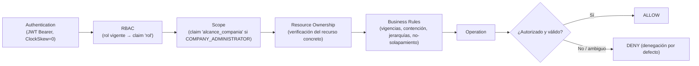

# Manual de Administrador

**Proyecto**: Enterprise Access Control Platform
**Estado**: **PROYECTO CERRADO**
**Versión de este manual**: 1.0 — 2026-09-26
**Dirigido a**: administradores globales y administradores de compañía del sistema (no desarrolladores).

---

## 1. Objetivo y alcance

Este manual documenta cómo administrar Enterprise Access Control una vez desplegado: gestión de usuarios y
roles administrativos, seguridad, configuración global, datos maestros, y procedimientos operativos
frecuentes. Complementa el [Manual de Usuario](02-manual-usuario.md) (funciones operativas del día a día) y
el [Manual de Despliegue](01-manual-despliegue-implementacion.md) (instalación).

Fuera de alcance: cambios de infraestructura, desarrollo de nuevas funciones, y cualquier actividad de
Etapa 2 (consultas transversales de auditoría/históricos, decisión D8) — ver
[`04-documentacion-tecnica-cierre.md`](04-documentacion-tecnica-cierre.md) §17.

## 2. Modelo de administración

El sistema separa dos autorizaciones independientes (research.md §18, README):

1. **Autorización de plataforma**: quién puede iniciar sesión y administrar dentro de qué alcance de
   compañías (esta sección).
2. **Motor de evaluación de acceso**: si una persona puede entrar físicamente a un área (documentado
   funcionalmente en el Manual de Usuario §11).

### Catálogo cerrado de roles

| Rol | Alcance | Regla fundamental |
|---|---|---|
| `GLOBAL_ADMINISTRATOR` | Todas las compañías del sistema | `CompañíaId` de la asignación es **nulo** si y solo si el rol es GLOBAL |
| `COMPANY_ADMINISTRATOR` | Exactamente las compañías de sus asignaciones vigentes | `CompañíaId` obligatorio en cada asignación |

El catálogo es **cerrado**: agregar un rol nuevo exige modificar el código del modelo de autorización, no
insertar una fila en una tabla de datos.

### Vigencia y renovación de asignaciones de rol

Cada asignación de rol (`AsignaciónRolAdministrativo`) tiene fecha de inicio y de fin obligatorias. Puede:

- **Finalizarse** anticipadamente (`POST /api/usuarios/{id}/roles/{asignacionId}/finalizar`).
- **Renovarse**, extendiendo su fecha de fin hacia adelante, sin crear un registro nuevo
  (`POST /api/usuarios/{id}/roles/{asignacionId}/renovar`) — solo mientras la asignación siga vigente
  dinámicamente; una asignación ya vencida o finalizada no es renovable.

Un `COMPANY_ADMINISTRATOR` **no puede**: administrar fuera de su compañía, elevar su propio alcance, asignar
`GLOBAL_ADMINISTRATOR`, ni asignar `COMPANY_ADMINISTRATOR` para una compañía distinta de la suya. Cualquier
operación fuera de esos límites requiere un `GLOBAL_ADMINISTRATOR` vigente.

### Bootstrap del primer administrador

En un despliegue nuevo, si no existe ningún `GLOBAL_ADMINISTRATOR` vigente, la API crea uno automáticamente
al arrancar, usando `Bootstrap:AdminEmail`/`Bootstrap:AdminPassword` (ver
[Manual de Despliegue §7](01-manual-despliegue-implementacion.md#7-configuración-de-variables-de-entorno)).
Es idempotente (no crea un segundo administrador en reinicios posteriores) y fuerza el cambio de contraseña
en el primer inicio de sesión. Su vigencia inicial usa una fecha de fin extremadamente lejana
(`2999-12-31T23:59:59Z`) como única excepción documentada a la regla general de vigencias reales.

## 3. Gestión de usuarios

Vía el módulo **Configuración → Usuarios**:

- **Creación**: correo, contraseña inicial (sujeta a la política de contraseñas, §6), y su primera
  asignación de rol (rol + compañía si aplica + vigencia).
- **Edición**: estado (`ACTIVO`/`INACTIVO`), forzar cambio de contraseña.
- **Búsqueda**: por correo, con coincidencia parcial, aplicada **sobre todo el conjunto dentro de su alcance
  autorizado y antes de paginar** — nunca solo sobre la página ya cargada.
- **Estado**: un usuario `BLOQUEADO` (por intentos fallidos) requiere desbloqueo administrativo explícito
  (`POST /api/usuarios/{id}/desbloquear`); un usuario `INACTIVO` no puede iniciar sesión hasta reactivarse.
- **Compañía y roles**: ver §4.
- **Asignaciones**: cada usuario puede tener varias asignaciones de rol vigentes simultáneas (por ejemplo,
  `COMPANY_ADMINISTRATOR` de varias compañías a la vez); no puede tener más de una asignación
  `COMPANY_ADMINISTRATOR` vigente **para la misma compañía** al mismo tiempo (secuenciales sí se permiten).

## 4. Roles administrativos

| Aspecto | `GLOBAL_ADMINISTRATOR` | `COMPANY_ADMINISTRATOR` |
|---|---|---|
| Alcance | Todas las compañías | Compañías de sus asignaciones vigentes |
| Puede crear/asignar | Cualquier rol, para cualquier compañía | Solo `COMPANY_ADMINISTRATOR` para su propia compañía |
| Puede elevar su propio rol | No aplica (ya es el máximo) | No, nunca |
| Vigencia | Obligatoria; renovable mientras vigente | Obligatoria; renovable mientras vigente |
| Restricciones de delegación | Ninguna | No puede administrar, ver ni modificar recursos fuera de su alcance — una lectura fuera de alcance responde "no encontrado" (404), nunca "prohibido" |

Cambiar el rol o la compañía de una asignación existente **no está soportado como edición directa**: se
finaliza la asignación actual y se crea una nueva.

## 5. Seguridad y autorización

Puntos clave verificados:

- **Denegación por defecto a nivel de plataforma**: `Program.cs` declara una política de reserva
  (`SetFallbackPolicy(RequireAuthenticatedUser)`) — un endpoint que olvidara declarar su autorización queda
  protegido igual, en vez de quedar accidentalmente público. Las únicas excepciones explícitas son login, los
  dos *health checks*, y el documento OpenAPI (solo en `Development`).
- **El alcance viaja en el token**, no se recalcula contra la base de datos en cada request: cambiar las
  asignaciones de un usuario no tiene efecto hasta que ese usuario vuelva a iniciar sesión o su token expire
  (60 minutos por defecto).
- **Poseer un identificador no otorga autorización**: una lectura fuera de alcance responde `404`, incluso
  con un identificador real y conocido, sobre los siete tipos de recurso con identificador propio (usuario,
  compañía, unidad organizativa, área de acceso, persona, contexto operativo, asignación de credencial).
- **Toda denegación por alcance es libre de efectos**: la verificación ocurre antes de cualquier escritura.
- **Las búsquedas y filtros administrativos** se aplican dentro del alcance ya restringido y antes de
  paginar; nunca lo amplían ni sirven para enumerar recursos ajenos.

## 6. Configuración global

Configuraciones reales soportadas por el sistema (ver también
[Manual de Despliegue §7](01-manual-despliegue-implementacion.md#7-configuración-de-variables-de-entorno)):

| Configuración | Clave | Valor por defecto |
|---|---|---|
| Zona horaria global de respaldo | `ZonaHoraria:TimeZoneId` | `America/Lima` |
| Emisor / audiencia JWT | `Jwt:Issuer` / `Jwt:Audience` | `enterprise-access-control` / `enterprise-access-control-spa` |
| Vigencia del access token | `Jwt:AccessTokenMinutos` | `60` |
| Clave de firma JWT | `Jwt:SigningKey` | Sin valor por defecto en producción; en desarrollo, clave versionada de conveniencia (nunca reutilizar) |
| Política de contraseñas | `PasswordPolicy:*` (ver tabla siguiente) | Ver tabla siguiente |
| Correo/contraseña del administrador inicial | `Bootstrap:AdminEmail` / `Bootstrap:AdminPassword` | Sin valor por defecto para la contraseña, en ningún entorno |
| Cadena de conexión a SQL Server | `ConnectionStrings:SqlServer` | Sin valor por defecto en producción |

### Política de contraseñas (ratificada, decisión D9)

| Regla | Valor por defecto |
|---|---|
| Longitud mínima | 10 caracteres |
| Requiere mayúscula | Sí |
| Requiere minúscula | Sí |
| Requiere dígito | Sí |
| Intentos fallidos para bloqueo | 5 |
| Días de expiración | 90 |
| Historial no reutilizable | 5 contraseñas previas |

> Estos valores fueron ratificados como **definitivos** por la decisión de negocio #1 (cerrada 2026-09-20).
> El comentario de `docker-compose.prod.yml` que aún los describe como "provisionales" es una inconsistencia
> documental menor, conocida y fuera del alcance del cierre — no indica que el valor esté en revisión.

## 7. Gestión de compañías

Ver [Manual de Usuario §4](02-manual-usuario.md#4-gestión-de-compañías) para el flujo funcional. Notas
específicas de administración:

- Solo un `GLOBAL_ADMINISTRATOR`, o un `COMPANY_ADMINISTRATOR` dentro de su propia compañía, puede crear o
  editar compañías dentro de su alcance.
- Inactivar una Compañía Principal o de pertenencia de una persona **deniega el acceso de forma dinámica**
  (recalculada en cada evaluación), sin cerrar ni modificar ningún registro dependiente; reactivarla
  restablece el acceso automáticamente, sin intervención adicional.
- Cambiar la clasificación (`TipoCompañía`) de una compañía con dependencias incompatibles (áreas propias,
  raíces de unidad organizativa, relaciones Contratista↔Principal vigentes, contextos operativos o
  credenciales) se rechaza explícitamente hasta resolver esas dependencias.

## 8. Datos maestros

Catálogos versionados administrables desde **Datos maestros** (todos con semilla inicial para Perú, RF-031):

| Catálogo | Semilla inicial |
|---|---|
| Tipo de documento | DNI, Carné de Extranjería, Pasaporte, RUC |
| Tipo de sangre | O+, O-, A+, A-, B+, B-, AB+, AB- |
| Género | Masculino, Femenino |
| Tipo de persona | Definido por el administrador (p. ej. Trabajador, Visitante, Proveedor) |
| Tipo de credencial | Definido por el administrador (p. ej. Credencial Contratista, Corporativo, Visitante, Temporal) |

Cada catálogo admite alta y edición (`ACTIVO`/`INACTIVO`); un valor `INACTIVO` no puede asignarse a registros
nuevos, pero los ya asignados conservan su histórico intacto.

## 9. Gestión de personas

Ver [Manual de Usuario §7–§8](02-manual-usuario.md#7-personas). Como administrador, tenga en cuenta:

- El número de documento es único **globalmente** para cada tipo de documento — el sistema rechaza
  duplicados incluso entre compañías distintas.
- Cerrar una pertenencia dispara la revocación automática en cascada de todos sus contextos, unidades y
  credenciales dependientes: no requiere (ni admite) cerrarlos manualmente uno por uno.

## 10. Gestión de credenciales

Ver [Manual de Usuario §9](02-manual-usuario.md#9-credenciales). Recuerde: una credencial nunca sustituye a
un permiso — es una condición **necesaria pero no suficiente** para conceder acceso. Asignar una nueva
credencial nunca cierra automáticamente una anterior; un solapamiento se rechaza explícitamente.

## 11. Gestión de permisos

Ver [Manual de Usuario §10](02-manual-usuario.md#10-permisos). Como administrador, la precedencia de
conflictos es fija y no configurable: **Persona > Unidad organizativa > Compañía**.

## 12. Auditoría

Cada entidad persistente registra automáticamente, sin intervención del operador: fecha de creación, fecha de
última actualización, y los usuarios responsables de ambas (Principio III de la constitución). Esta
información es consultable en el detalle de cada registro individual.

**No existe** una pantalla agregada/transversal de auditoría (filtrable por usuario, entidad, compañía o
rango de fechas): quedó diferida a Etapa 2 (decisión D8, RF-067 a RF-069) y **está fuera del alcance del
proyecto cerrado**.

## 13. Logs y diagnóstico

| Aspecto | Detalle verificado |
|---|---|
| Dónde aparecen | Salida estándar del contenedor `eac-api` (`docker logs eac-api`) |
| Niveles configurados | `Default: Information`, `Microsoft.AspNetCore: Warning` (`appsettings.json`); en desarrollo se añade `Microsoft.EntityFrameworkCore.Database.Command: Information` para ver el SQL generado |
| Integración con herramientas externas de logging/observabilidad | **No existe.** El sistema no integra ningún backend de logging centralizado (ELK, Application Insights, OpenTelemetry, etc.) — **[NO DOCUMENTADO EN EL REPOSITORIO]**, y no debe asumirse presente |
| Eventos importantes a vigilar | Fallos de arranque por variables de entorno ausentes; `Cannot open database` (SQL error 4060, migraciones no aplicadas); `503` de `/health/ready` (SQL Server no responde) |
| Troubleshooting | Ver [Manual de Despliegue §13](01-manual-despliegue-implementacion.md#13-troubleshooting) |

## 14. Seguridad operacional

- **Secretos**: `Jwt:SigningKey`, `Bootstrap:AdminPassword`, `MSSQL_SA_PASSWORD` y
  `SQLSERVER_CONNECTION_STRING` **nunca deben versionarse**; se suministran por variable de entorno o gestor
  de secretos del host. `docker-compose.prod.yml` se niega a arrancar si faltan.
- **Contraseñas**: nunca se almacenan en texto plano (`PasswordHasher<T>` de ASP.NET Core Identity, usado
  solo como algoritmo de hash).
- **JWT**: `ClockSkew = 0` — la expiración del token se respeta exactamente, sin margen de tolerancia.
- **HTTPS**: la terminación TLS es responsabilidad del proxy inverso (fuera del repositorio); ni la API ni
  SQL Server se exponen directamente a Internet en producción (puertos publicados solo en `127.0.0.1`).
- **Acceso a SQL Server**: en producción, el puerto de SQL Server se publica solo en la interfaz local del
  host, para permitir migraciones y administración sin exponerlo a la red.
- **Principio de mínimo privilegio**: el contenedor de la API corre con un usuario sin privilegios
  (`$APP_UID`); la API no configura CORS, restringiendo de facto el consumo a su propio origen servido por el
  proxy.
- **Aislamiento por compañía**: reforzado en cada capa (RBAC, Resource Ownership, filtrado de consultas) —
  ver §5.

## 15. Backup y recuperación

**Solo según mecanismos realmente implementados.** El repositorio persiste los datos de SQL Server en un
volumen Docker con nombre (`eac-sqlserver-data` en desarrollo, `sqlserver-data` en producción), lo que
sobrevive a un `docker compose down`/`up` normal, pero **no constituye una estrategia de backup**: no hay
ningún job, script ni procedimiento de `BACKUP DATABASE`/`RESTORE DATABASE` versionado en el repositorio.

**[NO DOCUMENTADO EN EL REPOSITORIO].** Cualquier procedimiento formal de backup y recuperación (frecuencia,
retención, prueba de restauración) debe definirse operacionalmente fuera de este repositorio antes de operar
en producción con datos reales.

## 16. Procedimientos administrativos frecuentes

### Crear el segundo administrador global

1. Inicie sesión como `GLOBAL_ADMINISTRATOR`.
2. Cree el usuario nuevo (§3) con su contraseña inicial.
3. Asigne el rol `GLOBAL_ADMINISTRATOR`, sin compañía, con vigencia definida.

### Delegar la administración de una compañía

1. Inicie sesión como `GLOBAL_ADMINISTRATOR` (un `COMPANY_ADMINISTRATOR` no puede hacer esto para otra
   compañía).
2. Cree o edite el usuario destino.
3. Asigne el rol `COMPANY_ADMINISTRATOR` con la compañía y la vigencia correspondientes.

### Desbloquear un usuario

1. Localice al usuario en **Configuración → Usuarios** (búsqueda por correo).
2. Verifique que su estado sea `BLOQUEADO`.
3. Ejecute la acción de desbloqueo; el contador de intentos fallidos se reinicia.

### Renovar una asignación de rol próxima a vencer

1. Abra el detalle del usuario → pestaña de asignaciones de rol.
2. Seleccione la asignación vigente y elija "Renovar", indicando una nueva fecha de fin **posterior** a la
   actual.
3. Confirme: la operación no crea un registro nuevo ni modifica el rol o la compañía asignados.

### Finalizar anticipadamente una asignación de rol

1. Igual que el paso anterior, pero eligiendo "Finalizar" en lugar de "Renovar".
2. Esta acción sí requiere confirmación explícita, porque retira alcance administrativo de inmediato para el
   próximo inicio de sesión del usuario afectado.

### Inactivar una compañía sin perder datos

1. Edite la compañía y cambie su estado a `INACTIVO`.
2. Verifique que el efecto es inmediato en la evaluación de acceso (deniega) y reversible (reactivar
   restablece el acceso), sin necesidad de tocar ningún registro dependiente.

---

**Documentos relacionados**: [`01-manual-despliegue-implementacion.md`](01-manual-despliegue-implementacion.md) ·
[`02-manual-usuario.md`](02-manual-usuario.md) ·
[`04-documentacion-tecnica-cierre.md`](04-documentacion-tecnica-cierre.md) ·
[Diagrama del flujo de autorización](diagrams/autorizacion.md)
