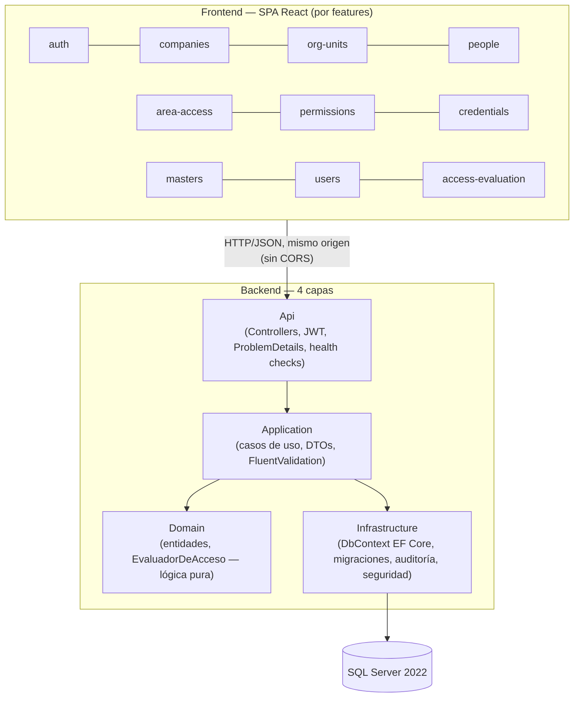

# Documentación Técnica de Cierre

**Proyecto**: Enterprise Access Control Platform
**Estado**: **PROYECTO CERRADO**
**Versión de este documento**: 1.0 — 2026-09-26
**Fecha de cierre del proyecto**: 2026-09-26 (cierre documental de la validación funcional post-Baseline)
**Stack**: .NET 10 / ASP.NET Core Web API · EF Core 10 · SQL Server 2022 · React 18 + TypeScript 6 + Vite 8

> Este documento es el entregable técnico final del proyecto. No propone trabajo futuro comprometido: toda
> mención de Etapa 2 o de funcionalidad diferida se identifica explícitamente como **fuera de alcance**, no
> como próximo paso planificado.

---

## 1. Información general

| Campo | Valor |
|---|---|
| Nombre | Enterprise Access Control Platform |
| Objetivo | Centralizar, con validación 100% server-side y denegación por defecto, quién puede acceder físicamente a qué área de una instalación, en qué horario y bajo qué credencial |
| Estado | **CERRADO** (Baseline T001–T242 + post-Baseline T243–T312, VF-001 a VF-011 `CLOSED`) |
| Versión funcional | Sin versión semántica de producto declarada en el repositorio (**[NO DOCUMENTADO EN EL REPOSITORIO]**); el estado se identifica por el commit de cierre `dc1edea` |
| Fecha de cierre | 2026-09-26 |
| Stack | .NET 10 / C# 13 / ASP.NET Core 10 · EF Core 10 · SQL Server 2022 · React 18.3.1 · TypeScript 6.0.3 · Vite 8.3.0 |
| Repositorio | `https://github.com/DavidSanchezR/enterprise-access-control` (rama `main`) |
| Metodología | Spec-Driven Development con GitHub Spec Kit + Claude Code |

## 2. Resumen ejecutivo técnico

Enterprise Access Control es una aplicación web de dos capas (SPA + API) que modela de forma explícita
compañías (Principales y Contratistas), su estructura organizativa y física, personas con históricos de
pertenencia y contexto operativo multi-Principal, credenciales, permisos con vigencia y bloques horarios, y
un motor de evaluación de acceso de 15 pasos con denegación por defecto. El backend está organizado en cuatro
capas (Domain → Application → Infrastructure → API); el frontend es una SPA React por *features*. El sistema
se construyó siguiendo estrictamente el ciclo de Spec Kit (`/speckit-constitution` →
`/speckit-specify` → `/speckit-clarify` → `/speckit-plan` → `/speckit-tasks` → `/speckit-implement` →
`/speckit-analyze` → `/speckit-checklist`), con 81 requisitos funcionales, 41 criterios de éxito y 15
sesiones de clarificación de negocio formalizadas en `spec.md`.

El Baseline (T001–T242) implementa las Historias 1 a 9 (P1 y P2) con API e interfaz, respaldadas por 5 suites
de prueba automatizada. Tras su cierre, una validación funcional post-Baseline sobre la interfaz real
identificó 11 hallazgos (VF-001 a VF-011); los 11 están **cerrados**, algunos como defectos corregidos, otros
como cambios de requisito formalizados vía Spec Kit (RF-082, RF-083), y otros como comportamiento correcto
confirmado sin cambios. La Historia 10 (consultas transversales) quedó explícitamente diferida a Etapa 2 y
**fuera del alcance del proyecto cerrado**.

## 3. Arquitectura

### Diagrama de componentes (capas del backend + frontend)

Ver [diagramas/arquitectura.md](diagrams/arquitectura.md) para el diagrama completo. Resumen:



### Diagrama de despliegue

Ver [diagramas/despliegue.md](diagrams/despliegue.md). Resumen: solo la API está contenedorizada
(`backend/Dockerfile`, imagen `aspnet:10.0`); SQL Server usa la imagen oficial; la SPA se compila a estáticos
(`frontend/dist/`) servidos por un proxy inverso propio, no incluido en el repositorio.

### Capas y dependencias

| Capa | Dependencias permitidas | Evidencia |
|---|---|---|
| Domain | Ninguna externa (entidades, enums, `EvaluadorDeAcceso` como lógica pura) | `backend/src/EnterpriseAccessControl.Domain` |
| Application | Domain | `backend/src/EnterpriseAccessControl.Application` |
| Infrastructure | Domain, Application, EF Core, SQL Server | `backend/src/EnterpriseAccessControl.Infrastructure` |
| Api | Application, Infrastructure (composición de dependencias) | `backend/src/EnterpriseAccessControl.Api` |

## 4. Modelo de dominio

22 entidades de dominio, documentadas exhaustivamente en
[`data-model.md`](../../specs/001-control-acceso-empresarial/data-model.md). Ver el diagrama simplificado en
[diagramas/dominio.md](diagrams/dominio.md). Resumen de entidades:

| Entidad | Rol |
|---|---|
| `Usuario`, `HistorialContraseña` | Autenticación e histórico de contraseñas |
| `AsignaciónRolAdministrativo` | RBAC de plataforma (D1) |
| `Compañía`, `RelaciónContratistaPrincipal` | Compañías (Principal/Contratista) y su relación N:N vigente |
| `UnidadOrganizativa`, `CompañíaPrincipalUnidadOrganizativaRaiz` | Jerarquía organizativa por Principal, sin FK directa de la unidad a la compañía |
| `TipoPersona`, `Persona`, `AsignaciónTipoPersona` | Catálogo de perfiles y su asignación histórica a personas |
| `AsignaciónPersonaCompañía` | Pertenencia (empleador), raíz de la contención y de la cascada de revocación |
| `ContextoOperativoPersonaPrincipal` | Relación operativa Persona↔Principal, independiente de la pertenencia |
| `AsignaciónPersonaUnidadOrganizativa` | Unidad organizativa dentro de un contexto operativo |
| `ÁreaAcceso`, `ÁreaAccesoTipoPersona` | Jerarquía física de acceso y tipos de persona autorizados por área |
| `PermisoAcceso`, `BloqueHorarioPermiso` | Permisos con vigencia diaria (RF-083) y bloques horarios |
| `TipoCredencial`, `AsignaciónCredencial` | Diseño de credencial y su asignación histórica por Principal |
| `TipoDocumento`, `TipoSangre`, `Género` | Catálogos maestros versionados (semilla Perú) |

### Reglas temporales transversales (Principio IV)

- **Vigencia obligatoria** (RF-071): las seis asociaciones temporales de una persona nacen con inicio y fin
  reales; no existe `null` ni fecha centinela.
- **Contención** (RF-072, ampliada por RF-082/VF-007): las asociaciones dependientes de la pertenencia
  (contexto operativo, unidad organizativa, credencial, y desde VF-007 también perfil y permiso de alcance
  PERSONA) deben quedar contenidas dentro de la vigencia de la pertenencia vigente.
- **No-solapamiento por trigger**: 6 triggers SQL `AFTER INSERT, UPDATE`, sin representación en el modelo EF
  Core.
- **Vigencia ≠ Estado**: la vigencia efectiva siempre se determina comparando fechas, nunca por `Estado` en
  aislamiento.
- **Revocación en cascada** (RF-061 a RF-065): cerrar una pertenencia cierra, en la misma transacción, los
  contextos, unidades y credenciales dependientes, sin eliminar historial.
- **Renovación** (RF-073, RF-075): extiende `FechaHoraFin` hacia adelante sin crear registro nuevo, solo
  mientras la asociación siga vigente dinámicamente.

## 5. Reglas de negocio relevantes

| Regla | Resumen |
|---|---|
| RF-014 / RF-052 | Una persona tiene como máximo una pertenencia activa, pero puede tener varios contextos operativos vigentes simultáneos (uno por Principal) |
| RF-053 / RF-054 | El contexto operativo con una Principal directa se fija automáticamente; con una Contratista, requiere `RelaciónContratistaPrincipal` vigente |
| RF-059 | La evaluación de acceso exige contexto operativo vigente y legítimo antes de evaluar cualquier permiso |
| RF-061 a RF-065 | Revocación automática en cascada por cese de pertenencia, con re-validación dinámica como defensa adicional |
| RF-066 / RF-070 | La credencial vigente es condición necesaria (no suficiente) para el acceso; su vigencia se evalúa dinámicamente, nunca por `Estado` aislado |
| RF-025 | Precedencia de permisos: PERSONA > UNIDAD_ORGANIZATIVA > COMPAÑÍA |
| RF-079 | Una compañía inactiva deniega el acceso por evaluación dinámica, sin cascada de escritura |
| RF-080 / RF-083 | Zona horaria IANA por Principal para bloques horarios; vigencia del permiso expresada como fechas civiles (post-Baseline, VF-004) |
| RF-074 a RF-077 | RBAC de plataforma con catálogo cerrado de roles y resolución de alcance por asignación vigente |
| Principio V | Jerarquías (unidades organizativas, áreas de acceso) sin ciclos, validadas server-side (CTE recursivo) |

## 6. Seguridad

Ver también [Manual de Administrador §5](03-manual-administrador.md#5-seguridad-y-autorización) y el
[diagrama de autorización](diagrams/autorizacion.md).

- **Autenticación**: JWT Bearer (`Microsoft.AspNetCore.Authentication.JwtBearer` 10.0.12), `ClockSkew = 0`.
- **Autorización de plataforma**: RBAC con catálogo cerrado (`GLOBAL_ADMINISTRATOR`,
  `COMPANY_ADMINISTRATOR`); alcance resuelto desde las claims del token (`rol`, `alcance_compania`), no
  recalculado por request.
- **Scopes**: por compañía, derivados de las asignaciones de rol vigentes del usuario.
- **Aislamiento**: Resource Ownership verificado por operación sobre los siete tipos de recurso con
  identificador propio; una lectura fuera de alcance responde `404`, nunca `403` (no revela existencia).
- **Auditoría**: automática por interceptor de EF Core (`CreatedAt`/`UpdatedAt`/`CreatedById`/`UpdatedById`)
  en toda entidad persistente, nunca aceptada del cliente.
- **Denegación por defecto**: a nivel de plataforma (`SetFallbackPolicy(RequireAuthenticatedUser)`) y a nivel
  del motor de evaluación de acceso (cualquier paso sin resultado inequívoco produce `DENEGADO`).

## 7. API

72 operaciones sobre 47 rutas, en 10 contratos OpenAPI, verificadas una por una por pruebas de contrato
(incluido un snapshot que compara el documento generado por `Microsoft.AspNetCore.OpenApi` contra los
archivos publicados en `contracts/`). Todas las rutas y métodos siguientes se verificaron directamente contra
los archivos `contracts/*.yaml` y contra el conteo de atributos `[Http*]` de cada controlador correspondiente
(paridad 1:1 confirmada). Autorización: JWT Bearer + RBAC/alcance de compañías en todos los endpoints salvo
los marcados **Anónimo**. Errores: `ProblemDetails` (RFC 7807/9457) con campo `codigo` estable; los códigos
de estado típicos son `400` (validación), `401` (sin sesión), `404` (fuera de alcance o inexistente), `409`
(conflicto de vigencia/solapamiento/dependencias). El detalle exacto de request/response de cada operación
está en su contrato — no se reproduce aquí para no divergir de la fuente de verdad versionada.

### `auth.yaml` (v1.0.0 · 3 rutas · 3 operaciones)

| Método | Ruta | Descripción | Autorización |
|---|---|---|---|
| POST | `/api/auth/login` | Inicio de sesión (correo + contraseña) → JWT | **Anónimo** |
| POST | `/api/auth/cambiar-password` | Cambio de la propia contraseña | Sesión válida |
| GET | `/api/auth/sesion` | Información de la sesión actual | Sesión válida |

### `users.yaml` (v2.1.0 · 6 rutas · 9 operaciones)

| Método | Ruta | Descripción | Autorización |
|---|---|---|---|
| GET | `/api/usuarios` | Listar/buscar usuarios (búsqueda server-side, D-4) | RBAC + alcance |
| POST | `/api/usuarios` | Crear usuario con su primera asignación de rol | RBAC + alcance |
| GET | `/api/usuarios/{id}` | Detalle de usuario | RBAC + alcance |
| PUT | `/api/usuarios/{id}` | Editar usuario | RBAC + alcance |
| POST | `/api/usuarios/{id}/desbloquear` | Desbloqueo administrativo | RBAC + alcance |
| GET | `/api/usuarios/{id}/roles` | Listar asignaciones de rol | RBAC + alcance |
| POST | `/api/usuarios/{id}/roles` | Crear asignación de rol | RBAC + alcance |
| POST | `/api/usuarios/{id}/roles/{asignacionId}/finalizar` | Finalizar asignación de rol | RBAC + alcance |
| POST | `/api/usuarios/{id}/roles/{asignacionId}/renovar` | Renovar asignación de rol (D-1) | RBAC + alcance |

### `masters.yaml` (v1.0.0 · 10 rutas · 15 operaciones)

| Método | Ruta | Descripción |
|---|---|---|
| GET / POST | `/api/maestros/tipos-documento` | Catálogo de tipo de documento |
| PUT | `/api/maestros/tipos-documento/{id}` | Editar tipo de documento |
| GET / POST | `/api/maestros/tipos-sangre` | Catálogo de tipo de sangre |
| PUT | `/api/maestros/tipos-sangre/{id}` | Editar tipo de sangre |
| GET / POST | `/api/maestros/generos` | Catálogo de género |
| PUT | `/api/maestros/generos/{id}` | Editar género |
| GET / POST | `/api/maestros/tipos-persona` | Catálogo de tipo de persona |
| PUT | `/api/maestros/tipos-persona/{id}` | Editar tipo de persona |
| GET / POST | `/api/maestros/tipos-credencial` | Catálogo de tipo de credencial |
| PUT | `/api/maestros/tipos-credencial/{id}` | Editar tipo de credencial |

*(Todas requieren sesión autenticada con alcance administrativo; catálogos maestros son de alcance global de
lectura, con edición reservada a roles administrativos.)*

### `companies.yaml` (v1.0.0 · 4 rutas · 7 operaciones)

| Método | Ruta | Descripción |
|---|---|---|
| GET | `/api/companias` | Listar compañías |
| POST | `/api/companias` | Crear compañía |
| GET | `/api/companias/{id}` | Detalle de compañía |
| PUT | `/api/companias/{id}` | Editar compañía |
| GET | `/api/companias/{contratistaId}/relaciones-principales` | Listar relaciones Contratista↔Principal |
| POST | `/api/companias/{contratistaId}/relaciones-principales` | Crear relación |
| POST | `/api/companias/{contratistaId}/relaciones-principales/{id}/finalizar` | Finalizar relación |

### `org-units.yaml` (v1.0.0 · 4 rutas · 6 operaciones)

| Método | Ruta | Descripción |
|---|---|---|
| GET | `/api/unidades-organizativas` | Listar unidades |
| POST | `/api/unidades-organizativas` | Crear unidad |
| GET | `/api/unidades-organizativas/arbol` | Árbol anidado por Compañía Principal |
| GET | `/api/unidades-organizativas/{id}` | Detalle de unidad |
| PUT | `/api/unidades-organizativas/{id}` | Editar unidad |
| POST | `/api/unidades-organizativas/{id}/mover` | Mover unidad en el árbol (valida ciclos) |

### `people.yaml` (v1.1.0 · 9 rutas · 15 operaciones)

| Método | Ruta | Descripción |
|---|---|---|
| GET | `/api/personas` | Buscar/listar personas |
| POST | `/api/personas` | Crear persona |
| GET | `/api/personas/{id}` | Detalle de persona |
| PUT | `/api/personas/{id}` | Editar persona |
| GET | `/api/personas/{id}/estado-efectivo` | Estado efectivo (vigencias resueltas) |
| GET | `/api/personas/{id}/historial-companias` | Listar pertenencias |
| POST | `/api/personas/{id}/historial-companias` | Crear pertenencia |
| POST | `/api/personas/{id}/historial-companias/{asignacionId}/finalizar` | Finalizar pertenencia (dispara cascada RF-061) |
| POST | `/api/personas/{id}/historial-companias/{asignacionId}/renovar` | Renovar pertenencia (RF-073) |
| GET | `/api/personas/{id}/contextos-operativos` | Listar contextos operativos |
| POST | `/api/personas/{id}/contextos-operativos` | Crear contexto operativo |
| GET | `/api/personas/{id}/contextos-operativos/{contextoId}/unidad-organizativa` | Consultar unidad asignada del contexto |
| POST | `/api/personas/{id}/contextos-operativos/{contextoId}/unidad-organizativa` | Asignar unidad organizativa al contexto |
| GET | `/api/personas/{id}/perfiles` | Listar perfiles/tipos de persona |
| POST | `/api/personas/{id}/perfiles` | Asignar perfil (contención RF-082 desde VF-007) |

### `area-access.yaml` (v1.0.0 · 5 rutas · 8 operaciones)

| Método | Ruta | Descripción |
|---|---|---|
| GET | `/api/areas-acceso` | Listar áreas |
| POST | `/api/areas-acceso` | Crear área |
| GET | `/api/areas-acceso/arbol` | Árbol anidado por Compañía Principal |
| GET | `/api/areas-acceso/{id}` | Detalle de área |
| PUT | `/api/areas-acceso/{id}` | Editar área |
| POST | `/api/areas-acceso/{id}/mover` | Mover área en el árbol (valida ciclos y Principal heredada) |
| GET | `/api/areas-acceso/{id}/tipos-persona` | Listar tipos de persona autorizados |
| PUT | `/api/areas-acceso/{id}/tipos-persona` | Actualizar tipos de persona autorizados |

### `permissions.yaml` (v2.0.0 · 2 rutas · 4 operaciones)

| Método | Ruta | Descripción |
|---|---|---|
| GET | `/api/permisos` | Listar permisos |
| POST | `/api/permisos` | Crear permiso (vigencia diaria RF-083, bloques horarios) |
| GET | `/api/permisos/{id}` | Detalle de permiso |
| PUT | `/api/permisos/{id}` | Editar permiso |

> `v2.0.0` (cambio mayor incompatible) fue introducido por VF-004/RF-083: la vigencia pasa de `date-time` a
> `date` en la petición, con instantes UTC efectivos, fecha civil y `vigenciaEnDiasCompletos` expuestos en la
> respuesta.

### `credentials.yaml` (v1.0.0 · 3 rutas · 4 operaciones)

| Método | Ruta | Descripción |
|---|---|---|
| GET | `/api/personas/{personaId}/credenciales` | Listar credenciales de la persona |
| POST | `/api/personas/{personaId}/credenciales` | Asignar credencial (por Compañía Principal) |
| POST | `/api/personas/{personaId}/credenciales/{id}/devolver` | Registrar devolución física |
| DELETE | `/api/personas/{personaId}/credenciales/{id}` | Baja lógica (no elimina el histórico) |

### `access-evaluation.yaml` (v1.0.0 · 1 ruta · 1 operación)

| Método | Ruta | Descripción |
|---|---|---|
| POST | `/api/evaluacion-acceso` | Evaluar acceso (persona, área, fecha/hora) → `CONCEDIDO`/`DENEGADO` + motivo tipificado |

## 8. Contratos OpenAPI

| Aspecto | Detalle |
|---|---|
| Ubicación | `specs/001-control-acceso-empresarial/contracts/*.yaml` (10 archivos) |
| Generación | Documento nativo de `Microsoft.AspNetCore.OpenApi` (no Swashbuckle), publicado en `/openapi/v1.json` **solo en `Development`** |
| Validación | `OpenApiSnapshotTests` compara el documento generado contra los 10 archivos publicados; `*ContractTests` por grupo funcional verifican cada operación, incluido el formato `ProblemDetails` |
| Snapshots | El snapshot del documento OpenAPI generado es parte de la suite de contrato (252/252, ver §11) |
| Versionado por contrato | `auth` 1.0.0 · `users` 2.1.0 · `masters` 1.0.0 · `companies` 1.0.0 · `org-units` 1.0.0 · `people` 1.1.0 · `area-access` 1.0.0 · `permissions` 2.0.0 · `credentials` 1.0.0 · `access-evaluation` 1.0.0 |

> **Nota de control de calidad documental.** Los valores de la tabla anterior se verificaron leyendo el
> campo `version:` de cada archivo `contracts/*.yaml` directamente (fuente primaria). La tabla de
> "Contrato de API" del README raíz muestra `people.yaml` como `1.0.0`; el archivo real declara `1.1.0`
> (coherente con la subida de versión que registra
> [`post-baseline-validation.md` §9.1](../functional-validation/post-baseline-validation.md) al cerrar
> VF-007). Es una inconsistencia documental menor entre el README y el contrato real, detectada durante la
> revisión cruzada de este cierre; no afecta ninguna decisión de negocio ni el comportamiento del sistema.

## 9. Base de datos

Ver [Manual de Despliegue §10–§11](01-manual-despliegue-implementacion.md#10-base-de-datos) para el
procedimiento operativo. Resumen técnico:

- **Motor**: SQL Server 2022, `datetime2(3)` en UTC, CTE recursivos (validación de ciclos jerárquicos),
  `rowversion` (concurrencia optimista, solo en entidades con escritura concurrente real).
- **EF Core**: 12 migraciones de esquema + 1 migración de seed de catálogos maestros de Perú.
- **Índices**: índice clúster sobre `CreatedAt` (con `Id` como `NONCLUSTERED`) en `HistorialContraseña` y
  `AsignaciónRolAdministrativo` — únicamente esas dos entidades, pese a que un comentario del código
  (`ConfiguracionExtensions.ConClusterPorCreatedAt`) afirme que cubre "las 6 entidades de histórico de alto
  volumen"; es una inconsistencia menor conocida, documentada y fuera del alcance del cierre.
- **Restricciones**: 6 triggers SQL `AFTER INSERT, UPDATE` de no-solapamiento temporal (equivalente
  idiomático del `EXCLUDE USING gist` de PostgreSQL, sin soporte nativo en SQL Server), sin representación en
  el modelo de EF Core (`HasTrigger`, para evitar que EF use `OUTPUT` en las escrituras).
- **Auditoría**: interceptor de `SaveChanges` que estampa `CreatedAt`/`UpdatedAt`/`CreatedById`/`UpdatedById`
  en toda entidad auditable.

## 10. Frontend

| Aspecto | Detalle |
|---|---|
| Framework | React 18.3.1 + TypeScript 6.0.3 (nota: `plan.md` declara "TypeScript 5.6+"; lo instalado es TypeScript 6 — divergencia documentada en README) |
| Build tool | Vite 8.3.0 |
| Estado de servidor | TanStack Query (`@tanstack/react-query` 5.x) |
| Formularios y validación | React Hook Form 7.x + Zod 4.x (`@hookform/resolvers`) |
| Enrutamiento | React Router 7.x |
| Cliente HTTP | Axios 1.x, normalizado a `ProblemDetails` en `lib/apiClient.ts` |
| Estructura | Por *features* (`auth`, `companies`, `org-units`, `people`, `area-access`, `permissions`, `credentials`, `masters`, `users`, `access-evaluation`), cada una con su propia hoja de estilos |
| Componentes compartidos | `Tree` (patrón ARIA `treeview`, navegable por teclado) y `Dialogo`; sin librería de terceros de componentes |
| Design tokens | `src/index.css` (paleta claro/oscuro, tipografía `system-ui`, radios, sombras) |
| Integración con la API | Mismo origen (sin CORS); proxy de Vite en desarrollo vía `VITE_API_PROXY_TARGET` |
| Accesibilidad | WCAG 2.2 AA como objetivo declarado (`ux-ui.md`); verificada por prueba automatizada sobre el componente `Tree` |

## 11. Pruebas

Ejecución final registrada el 2026-09-25, al cerrar la validación post-Baseline (con Docker activo):

| Suite | Cantidad | Tecnología | Propósito | Estado |
|---|---:|---|---|---|
| Backend — Unitarias | 155/155 | xUnit 2.9.3 + FluentAssertions 8.11.0 | Reglas de dominio y casos de uso de Application, sin base de datos | ✅ |
| Backend — Integración | 593/593 | Testcontainers.MsSql 4.15.0 (SQL Server real) | Verifica los 6 triggers de no-solapamiento y reglas que no tienen representación en EF Core | ✅ |
| Backend — Contrato | 252/252 | `Microsoft.AspNetCore.Mvc.Testing` + YamlDotNet 18.1.0 | Verifica la API (incl. `ProblemDetails` y snapshot OpenAPI) contra los 10 archivos de `contracts/` | ✅ |
| Frontend — Unitarias/componentes | 203/203 (20 archivos) | Vitest 5.0.0 + React Testing Library 16.x (jsdom) | Componentes, hooks y accesibilidad (WCAG 2.2 AA del `Tree`) | ✅ |
| Frontend — E2E | 9/9 sobre base E2E acumulada · 8/9 desde base limpia | Playwright 1.63 | Flujos completos contra API y base de datos reales (`EnterpriseAccessControl_E2E`) | ✅ (matiz conocido, ver abajo) |

**Matiz conocido, no funcional**: el caso `UX-22` (búsqueda de un usuario fuera de la primera página) solo
pasa si la base de datos E2E acumuló más de 20 usuarios en corridas previas; es un defecto de aislamiento de
la propia prueba (no siembra los usuarios que necesita), no del producto — la funcionalidad que verifica está
además cubierta y siempre en verde por `BusquedaUsuariosTests` (integración, T239). No hay pipeline de
integración continua (`.github/workflows` no existe); las cinco suites se ejecutan localmente.

## 12. Validación funcional post-Baseline

Registrada íntegramente en
[`docs/functional-validation/post-baseline-validation.md`](../functional-validation/post-baseline-validation.md).
Los 11 hallazgos siguieron el ciclo `OPEN → ANALYZING → FIXED → VALIDATED → CLOSED`; **todos están en
`CLOSED`**. Ninguno reabre ni modifica T001–T242.

| ID | Módulo | Clasificación final | Solución | Tareas | Validación manual | Estado |
|---|---|---|---|---|---|---|
| VF-001 | Compañías | Defecto de implementación (frontend) | Selector de tipo de documento por catálogo, no UUID | T279–T281 | Sí | **CLOSED** |
| VF-002 | Unidades organizativas | Defecto de implementación (frontend) | Expansión/contracción del árbol con el ratón | T282–T284 | Sí | **CLOSED** |
| VF-003 | Áreas de acceso | Defecto de implementación (frontend), misma causa raíz que VF-002 | Evidencia y pruebas propias de la pantalla de áreas | T285–T286 | Sí | **CLOSED** |
| VF-004 | Permisos de acceso | Cambio de requisito post-Baseline (RF-083) | Vigencia diaria por fecha civil en la zona de la Principal | T287–T312 | Sí | **CLOSED** |
| VF-005 | Permisos de acceso | Gap UX | Placeholder "Ingrese su nro. de documento" | T267–T269 | Sí (técnica) | **CLOSED** |
| VF-006 | Personas | Comportamiento correcto (sin cambios) | Ya existía selección de unidad sobre árbol en el contexto operativo | — | Sí | **CLOSED** |
| VF-007 | Personas | Cambio de requisito post-Baseline (RF-082) | Contención temporal extendida a perfiles y permisos PERSONA | T243–T266 | Sí | **CLOSED** |
| VF-008 | Personas | Comportamiento conforme a RF-011 (sin cambios) | Múltiples perfiles simultáneos es el diseño esperado; eliminación de perfiles fuera de alcance | — | Sí | **CLOSED** |
| VF-009 | Personas | Comportamiento correcto (RF-072, sin cambios) | La contención de credenciales ya existía desde el Baseline | — | Sí | **CLOSED** |
| VF-010 | Usuarios | Defecto de implementación (visual) | Corrección CSS acotada (`.opcion-radio input { width: auto }`) | T270–T272 | Sí (técnica) | **CLOSED** |
| VF-011 | Usuarios | Defecto de implementación | Nombre de compañía resuelto en confirmación y detalle (extensión) | T273–T278 | Sí (técnica) | **CLOSED** |

**Evidencia automatizada acumulada del bloque post-Baseline**: Unitarias 141→155, Integración 567→593,
Contrato 250→252, Vitest 172→203, Playwright 9/9 (progresión completa documentada en cada sección del
registro de validación). No se reabrió ningún hallazgo.

## 13. Trazabilidad Spec → Tasks → Código → Tests

Matriz representativa por Historia de usuario (la matriz exhaustiva RF/CS/VF → tarea → evidencia está en
[`05-matriz-trazabilidad.md`](05-matriz-trazabilidad.md)):

| Historia | Requisitos clave | Bloque de tareas | Implementación | Evidencia de prueba |
|---|---|---|---|---|
| 1 — Login y alcance | RF-001 a RF-005, RF-034 | T023–T039 (fase US1) | `AuthController`, `Usuario` | Unitarias + integración + contrato de `auth.yaml` |
| 2 — Compañías y unidades | RF-006 a RF-009, RF-042 a RF-046 | T040–T065 | `CompaniasController`, `UnidadesOrganizativasController` | Integración (ciclos, aislamiento) + contrato |
| 3 — Datos maestros | RF-010, RF-017, RF-031 | T066–T075 | `MaestrosController` | Contrato `masters.yaml` |
| 4 — Personas | RF-012, RF-041 | T076–T090 | `PersonasController` | Integración (unicidad de documento) |
| 5 — Históricos y revocación | RF-014, RF-048 a RF-065, RF-071, RF-072 | T091–T168 (bloque mayor) | `PersonaService`, `RevocacionService`, `ReglasRevocacion` | Integración (cascada, contención) |
| 6 — Árbol de áreas | RF-009, RF-038, RF-046 | T108–T125 | `AreasAccesoController`, `Tree` | Vitest + integración (ciclos) |
| 7 — Tipos por área | RF-019 | T126–T135 | `AreasAccesoController` (tipos-persona) | Contrato + integración |
| 8 — Permisos y evaluación | RF-020 a RF-025, RF-059, RF-066, RF-083 | T136–T168, T287–T312 (VF-004) | `EvaluadorDeAcceso`, `EvaluacionAccesoService`, `PermisosController` | Unitarias (algoritmo 15 pasos) + integración + E2E |
| 9 — Credenciales | RF-018, RF-056 a RF-058, RF-070 | T091–T168 (parte) | `CredencialesController`, `AsignaciónCredencial` | Integración (solapamiento, contención) |
| Cierre Etapa 1 (D1–D9) | RF-074 a RF-081 | T169–T242 | RBAC, bootstrap, zona horaria, RBAC de compañía | Integración (CS-036 a CS-041) |
| Post-Baseline (VF-001 a VF-011) | RF-082, RF-083, correcciones UX | T243–T312 | Ver §12 | Ver §11 y §12 |

## 14. Trazabilidad Git/GitHub

Ver [diagramas/git-github.md](diagrams/git-github.md) para el grafo completo. Historial verificado
directamente con `git log`:

| Commit / Merge | Rama | PR | Contenido |
|---|---|---|---|
| `f8fb451` | `main` (commit inicial) | — | Implementación inicial: T001–T168 completadas y validadas |
| `56ebf26` … `69a7b41` | `feature/baseline-decisions` | — | Formalización de las decisiones D1–D9, RBAC, bootstrap, búsqueda server-side |
| `0783e24` | `feature/baseline-decisions` | — | `feat: complete baseline access control implementation` |
| `24bae44` | `main` | **PR #1** | Merge de `feature/baseline-decisions` |
| `cf6b5b3` | `feature/baseline-closure` | — | `docs: close baseline requirements gate` |
| `e2cc73f` | `main` | **PR #2** | Merge de `feature/baseline-closure` |
| `702a94c` | `docs/update-readme` | — | `docs: finalize project README` |
| `1326d82` | `main` | **PR #3** | Merge de `docs/update-readme` |
| `67932ec` | `fix/frontend-vite-env-proxy` | — | `fix(frontend): resolve Vite API proxy environment` |
| `688069f` | `main` | **PR #4** | Merge de `fix/frontend-vite-env-proxy` |
| `244fa09` | `feature/post-baseline-validation` | — | **`feat: complete post-baseline functional validation`** (VF-001 a VF-011) |
| `6a72260` | `main` | **PR #5** | **Merge de `feature/post-baseline-validation`** |
| `6d9d4d1` | `docs/close-post-baseline-validation` | — | `docs: record final closure of post-baseline validation` |
| `dc1edea` | `main` | **PR #6** | Merge de `docs/close-post-baseline-validation` — **HEAD actual** |

No existen tags de release en el repositorio (`git tag` vacío) — congelar una línea base con tag/rama quedó
como paso propuesto y **no ejecutado**, fuera del alcance del proyecto cerrado (ver §17).

## 15. Decisiones y desviaciones

### Decisiones de negocio del cierre de Etapa 1 (D1–D9)

| Decisión | Tema | Resolución |
|---|---|---|
| D1 | Modelo de administración de usuarios | RBAC de dos roles, alcance GLOBAL/COMPANY, asignaciones con vigencia auditable |
| D2 | Alta del primer administrador | Bootstrap automático idempotente |
| D3 | Aislamiento por alcance | Verificación del recurso concreto; `Persona` en alcance por pertenencia o contexto operativo |
| D4 | Inactivación de compañía | Denegación por evaluación dinámica, reversible, sin cascada de escritura |
| D5 | Calendario de vigencias | Zona horaria IANA por Principal + zona global de respaldo |
| D6 | Reclasificación de `TipoCompañía` | Rechazo si hay dependencias incompatibles |
| D7 | Interfaz de Historia 5 | Completada dentro de Etapa 1 |
| D8 | Consultas transversales (RF-067 a RF-069) | **Diferidas a Etapa 2 — fuera del alcance del proyecto cerrado** |
| D9 | Decisiones heredadas #1/#3/#7 | Política de contraseñas ratificada; sin retención/purga; Historia 9 permanece P2 |

### Desviaciones de implementación cerradas (D-1 a D-5)

| # | Desviación | Cierre |
|---|---|---|
| D-1 | Renovación de rol sin endpoint | `contracts/users.yaml` v2.1.0 añadió el endpoint de renovación |
| D-2 | Servicios auditados sin defecto real | Cerrada como cobertura de regresión (T237, T238) |
| D-3 | Orden de generación de migración | Cerrada como implementación válida |
| D-4 | Búsqueda de usuarios solo en la página cargada | Búsqueda server-side sobre todo el alcance, antes de paginar |
| D-5 | Contraseña de arranque por defecto en Compose | Eliminada; `BOOTSTRAP_ADMIN_PASSWORD` obligatoria también en desarrollo |

### Hallazgos post-Baseline (VF-001 a VF-011)

Ver §12. Ninguno permanece abierto.

## 16. Estado final

```text
BASELINE CERRADO (T001–T242, 242/242, gate 45/45 el 2026-09-21)
  +
VALIDACIÓN POST-BASELINE CERRADA (T243–T312, VF-001 a VF-011 en CLOSED)
  +
VALIDACIÓN MANUAL COMPLETADA (interfaz real, resultado satisfactorio)
  +
PR FINAL MERGED (PR #5, commit 244fa09 → merge 6a72260; cierre documental PR #6 → dc1edea)
  +
MAIN ACTUALIZADO (HEAD = dc1edea)
  =
PROYECTO CERRADO
```

## 17. Elementos fuera de alcance

Explícitamente diferidos, **sin tareas ni compromiso de implementación**:

- **Consultas transversales** (RF-067 a RF-069, CS-032): auditoría agregada filtrable, históricos
  transversales, Dashboard con indicadores (decisión D8). La ruta `/` del frontend muestra un marcador.
- **Revocación en cascada al finalizar una `RelaciónContratistaPrincipal`**: protegida solo por
  re-validación dinámica (RF-059/RF-065), sin cascada de escritura equivalente a RF-061.
- **Eliminación/desactivación de perfiles** (`AsignaciónTipoPersona`): la API solo expone `GET`/`POST`
  (observación de VF-008).
- **Integración continua**: no existe `.github/workflows`; las suites se ejecutan localmente.
- **Reproducibilidad de la suite E2E desde una base limpia** (`UX-22`): requiere que la prueba siembre sus
  propios datos; identificado como el paso más urgente de una lista de continuación **no ejecutada**.
- **Acta formal de un nuevo gate de cierre** posterior a T229–T242 y **tag/rama de release** congelando el
  Baseline: propuestos el 2026-09-23, **no ejecutados**, y fuera del alcance del proyecto cerrado.
- **Apertura formal de Etapa 2**: no ocurrió dentro de este proyecto.

## 18. Acta de Aceptación Final

> Los campos entre corchetes deben completarse manualmente por las partes responsables antes de firmar. No se
> han inventado nombres, fechas de firma ni firmas.

**Identificación del proyecto**: Enterprise Access Control Platform — repositorio
`DavidSanchezR/enterprise-access-control`, rama `main`, commit de cierre `dc1edea`.

**Objetivo**: Centralizar el control de acceso físico empresarial con validación server-side y denegación por
defecto, para una o varias Compañías Principales y sus Contratistas.

**Alcance entregado**: Baseline de Etapa 1 (Historias 1 a 9, P1 y P2 salvo consultas transversales) más la
validación funcional post-Baseline (VF-001 a VF-011, `CLOSED`). Historia 10 (consultas transversales)
explícitamente fuera de alcance (decisión D8).

**Entregables**:

- Código fuente completo (backend .NET 10, frontend React) en la rama `main`.
- Documentación de especificación completa (`specs/001-control-acceso-empresarial/`).
- 12 migraciones EF Core + 1 migración de seed, aplicables mediante procedimiento documentado.
- Contenedorización de la API (`backend/Dockerfile`, `docker-compose.yml`, `docker-compose.prod.yml`).
- Esta documentación final de entrega y cierre (`docs/final/`).

**Funcionalidades implementadas**: Historias 1 a 9 completas (API + interfaz), motor de evaluación de acceso
de 15 pasos, RBAC administrativo, revocación automática en cascada, 72 endpoints sobre 10 contratos OpenAPI.

**Pruebas realizadas**: 155 unitarias + 593 integración + 252 contrato (backend); 203 Vitest + 9 E2E
(frontend) — ver §11.

**Validación manual**: realizada sobre la interfaz real por el usuario del proyecto, con resultado
satisfactorio, para los 11 hallazgos post-Baseline (§12) y para los escenarios de `quickstart.md`.

**Incidencias/hallazgos**: 11 (VF-001 a VF-011), todos en estado `CLOSED` (§12). Ninguno permanece abierto.

**Estado de cierre**: **PROYECTO CERRADO** (§16).

**Evidencia Git/GitHub**: PR #1 a #6, mergeados en `main`; commit final de funcionalidad `244fa09`; merge
final funcional `6a72260`; cierre documental `dc1edea` (§14).

**Observaciones**: elementos fuera de alcance listados en §17; inconsistencias documentales menores conocidas
listadas en el README (sección "Alcance del proyecto cerrado").

**Conformidad**:

| Rol | Nombre | Cargo | Fecha | Firma |
|---|---|---|---|---|
| Responsable técnico | [RESPONSABLE] | [CARGO] | [FECHA] | [FIRMA] |
| Responsable de negocio / aceptación | [RESPONSABLE] | [CARGO] | [FECHA] | [FIRMA] |

---

## Información pendiente de completar manualmente

- Requisitos mínimos/recomendados de CPU, RAM, almacenamiento y navegadores soportados (Manual de Despliegue
  §5).
- Configuración concreta del proxy inverso de producción (no versionada en el repositorio).
- Procedimiento formal de backup y recuperación de SQL Server en producción (Manual de Administrador §15).
- Integración con herramientas externas de logging/observabilidad, si se decide incorporar en el futuro
  (Manual de Administrador §13).
- Nombres, cargos, fechas de firma y firmas del Acta de Aceptación Final (§18).
- Versión semántica formal del producto, si se decide adoptar una convención de versionado de release.

---

**Documentos relacionados**: [`01-manual-despliegue-implementacion.md`](01-manual-despliegue-implementacion.md) ·
[`02-manual-usuario.md`](02-manual-usuario.md) · [`03-manual-administrador.md`](03-manual-administrador.md) ·
[`05-matriz-trazabilidad.md`](05-matriz-trazabilidad.md) · [Diagramas](diagrams/)
