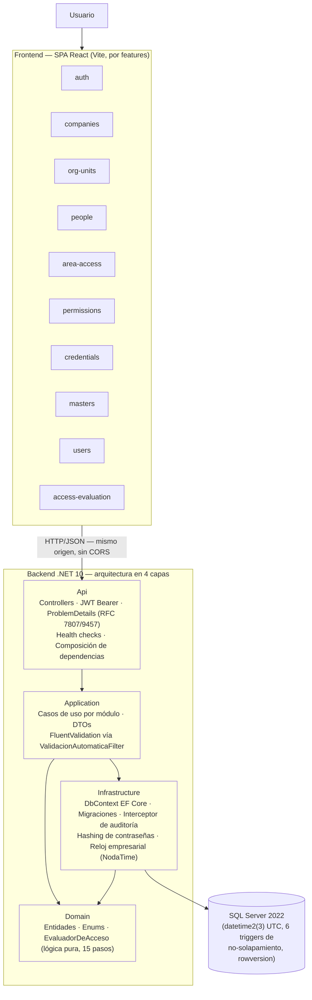

# Diagrama de Arquitectura

**Fuente**: README.md §Arquitectura, `backend/src/*/*.csproj`, `frontend/src/features/*`.

## Capas del backend + módulos del frontend

## Notas verificadas

- **Dependencias permitidas**: `Domain` no depende de ninguna capa externa; `Application` depende solo de
  `Domain`; `Infrastructure` implementa contratos de `Application`/`Domain`; `Api` compone todo en
  `Program.cs`.
- El **motor de evaluación de acceso** (`EvaluadorDeAcceso.cs`) vive en `Domain` como lógica pura —
  `EvaluacionAccesoService` (Application) es quien recolecta de la base de datos únicamente los datos que
  cada uno de sus 15 pasos necesita.
- La API **no configura CORS**: la SPA debe consumirse desde el mismo origen, detrás de un proxy inverso
  (ver [diagrama de despliegue](despliegue.md)).
- El frontend no tiene una capa de "servicios" central: cada *feature* encapsula sus propias llamadas HTTP
  (vía `lib/apiClient.ts`) y su propio estado de servidor (TanStack Query).
