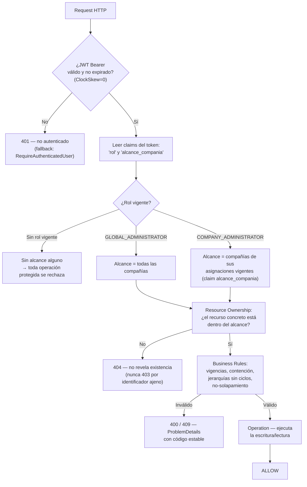
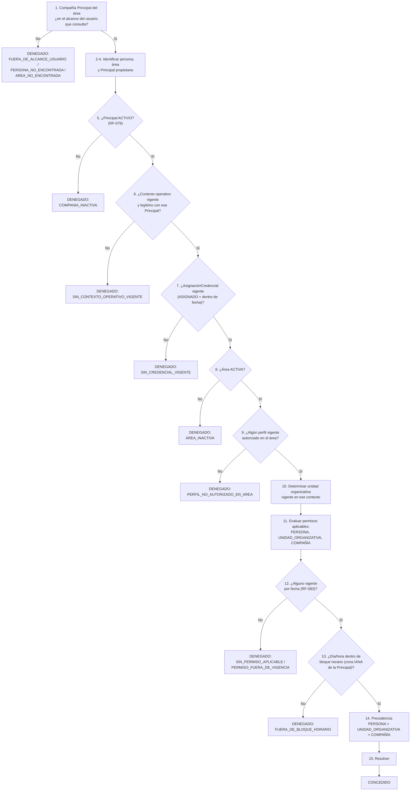

# Diagrama del Flujo de Autorización

**Fuente**: README §Modelo de autorización y §Motor de evaluación de acceso, `Program.cs`,
`EvaluadorDeAcceso.cs`, `research.md` §7 y §18.

> El sistema separa dos mecanismos de autorización **independientes**: la autorización de plataforma
> (quién puede administrar qué) y el motor de evaluación de acceso (si una persona puede entrar físicamente
> a un área). Este diagrama cubre ambos, en el orden en que realmente se ejecutan.

## 1. Autorización de plataforma (toda request administrativa)

## 2. Motor de evaluación de acceso (Historia 8 — 15 pasos, independiente de lo anterior)

## Notas verificadas

- Cualquier paso sin resultado inequívoco produce **DENEGADO** (denegación por defecto, Principio I) — no
  hay una rama "indeterminado ⇒ conceder".
- La credencial (paso 7) es **condición necesaria, no suficiente**: sin ella se deniega antes de evaluar
  ningún permiso, pero tenerla no concede acceso por sí sola.
- Inactivar una compañía (paso 5) deniega por **evaluación dinámica**, no por cascada de escritura:
  reactivarla restablece el acceso sin tocar ningún registro.
- Los 12 motivos de `MotivoDenegacion` están tipificados en `contracts/access-evaluation.yaml`.
- Detalle completo: [README §Motor de evaluación de acceso](../../../README.md#motor-de-evaluación-de-acceso)
  y `research.md` §7.
