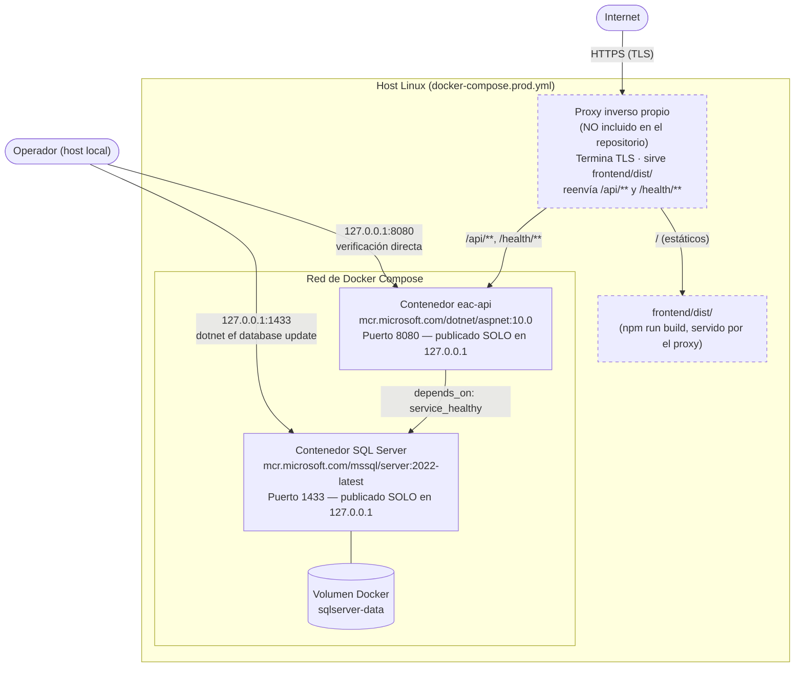
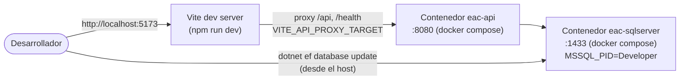
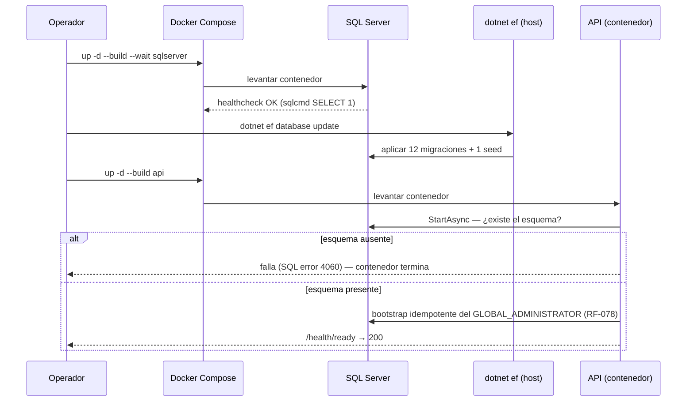

# Diagrama de Despliegue

**Fuente**: `docker-compose.yml`, `docker-compose.prod.yml`, `backend/Dockerfile`, README §Despliegue.

## Topología de contenedores — producción

## Topología de contenedores — desarrollo

## Secuencia de arranque (ambos entornos)

## Notas verificadas

- **Solo la API está contenedorizada.** No existe Dockerfile ni servicio de Compose para la SPA.
- En producción, **ningún puerto se expone fuera de `127.0.0.1`**: todo el tráfico externo entra por el
  proxy inverso (no versionado en el repositorio).
- La API **no aplica migraciones al arrancar**: el orden correcto es siempre
  `sqlserver sano → dotnet ef database update → api`.
- Ver [Manual de Despliegue e Implementación](../01-manual-despliegue-implementacion.md) para el
  procedimiento paso a paso completo.
