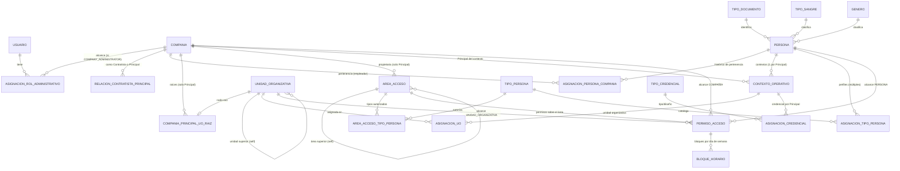
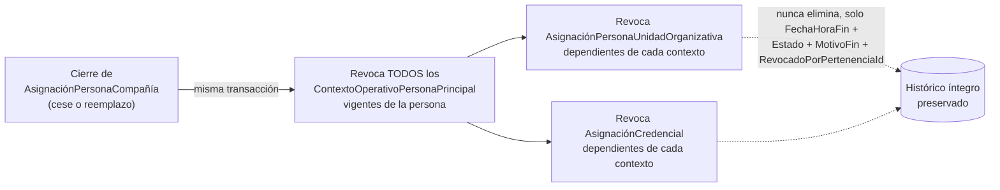

# Diagrama Simplificado del Dominio

**Fuente**: [`data-model.md`](../../../specs/001-control-acceso-empresarial/data-model.md) (22 entidades
completas; este diagrama simplifica las relaciones centrales para lectura rápida).

## Relación de revocación en cascada (RF-061 a RF-065)

## Notas verificadas

- `UnidadOrganizativa` **no tiene** ninguna columna ni relación directa hacia `Compañía` (restricción
  explícita de negocio, RF-044); su pertenencia se resuelve vía `CompañíaPrincipalUnidadOrganizativaRaiz` y
  recorriendo `UnidadSuperiorId` hasta la raíz.
- `ÁreaAcceso` sí tiene una FK directa `CompañíaPrincipalId` (sin la misma restricción).
- `AsignaciónPersonaUnidadOrganizativa` y `AsignaciónCredencial` cuelgan del **contexto operativo**, no
  directamente de la persona ni de la pertenencia — permitiendo que una persona tenga una unidad y una
  credencial distintas por cada Compañía Principal simultánea.
- Detalle completo de campos, validaciones e índices: `data-model.md` (22 entidades).
