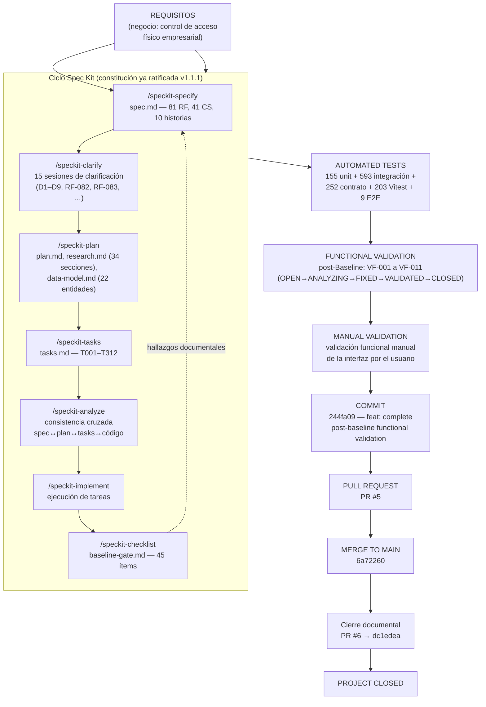
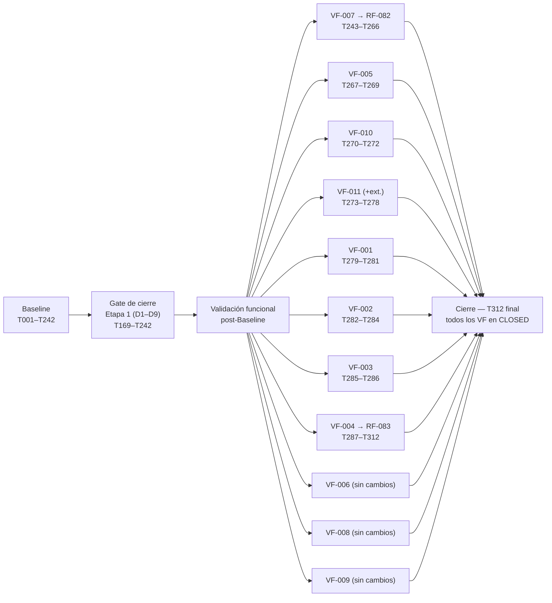

# Diagrama del Flujo Spec → Implementation → Validation

**Fuente**: README §Documentación de especificación (Spec Kit), `tasks.md`,
`docs/functional-validation/post-baseline-validation.md`, historial Git.

## Iteración real observada (no lineal en una sola pasada)

El ciclo de la izquierda **se recorrió varias veces**, no una sola: cada corrección post-Baseline (VF-004,
VF-007) volvió a entrar por `/speckit-clarify` y a salir por `/speckit-implement`, sin reabrir ni renumerar
las tareas ya cerradas (T001–T242 permanecen intactas). El propio README lo declara: *"ninguna sesión
posterior renumeró, reabrió ni reescribió tareas ya cerradas"*.

## Notas verificadas

- Cada VF-XXX que implicó cambio de código volvió a pasar por el ciclo completo de Spec Kit
  (`/speckit-clarify` → `/speckit-plan` → `/speckit-tasks` → `/speckit-analyze` → `/speckit-implement`) antes
  de tocar código de producción.
- Los VF que resultaron ser comportamiento correcto (VF-006, VF-008, VF-009) se cerraron **sin tareas
  nuevas**, tras validación manual, sin pasar por implementación.
- Ver [diagrama Git/GitHub](git-github.md) para el detalle de ramas, commits y PRs de este flujo.
