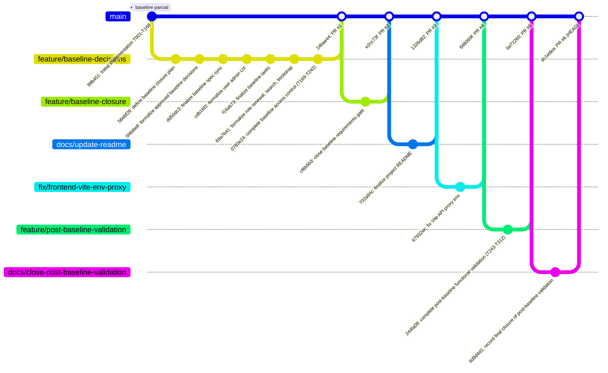

# Diagrama Git/GitHub del Proyecto

**Fuente**: `git log --all --oneline --graph --decorate`, `git branch -a`, `git tag` (verificado en vivo
contra el repositorio el 2026-09-26).

## Tabla resumen (fuente: `git log`, `git branch -a`, `git remote -v`)

| # | Rama origen | Commit(s) de la rama | Merge en `main` | Contenido |
|---|---|---|---|---|
| — | *(commit directo)* | `f8fb451` | *(commit inicial, sin PR)* | Implementación inicial T001–T168 |
| PR #1 | `feature/baseline-decisions` | `56ebf26` → `0783e24` (7 commits) | `24bae44` | Decisiones D1–D9, RBAC, bootstrap, T169–T242 |
| PR #2 | `feature/baseline-closure` | `cf6b5b3` | `e2cc73f` | Cierre del gate de requisitos (45/45) |
| PR #3 | `docs/update-readme` | `702a94c` | `1326d82` | Actualización final del README |
| PR #4 | `fix/frontend-vite-env-proxy` | `67932ec` | `688069f` | Corrección del proxy de entorno Vite |
| PR #5 | `feature/post-baseline-validation` | `244fa09` | `6a72260` | Validación funcional post-Baseline, T243–T312, VF-001 a VF-011 |
| PR #6 | `docs/close-post-baseline-validation` | `6d9d4d1` | `dc1edea` (**HEAD**) | Registro de cierre final de la validación post-Baseline |

**Remoto**: `origin` → `https://github.com/DavidSanchezR/enterprise-access-control.git`
**Rama principal**: `main` (usada para PRs)
**Tags**: ninguno creado (`git tag` sin salida) — congelar una línea base de release quedó fuera del alcance
del proyecto cerrado.

## Notas verificadas

- Las seis ramas de feature/fix/docs siguen existiendo tanto localmente como en `origin`, ya mergeadas — no
  se eliminaron tras el merge.
- Ningún commit reescribe o reordena el historial (`git log` es estrictamente lineal por fecha de commit
  dentro de cada rama); no hay `rebase` ni `force-push` visibles en el grafo.
- El commit `dc1edea` (merge de PR #6) es el **HEAD** actual de `main` y el punto de referencia de "proyecto
  cerrado" usado en toda esta documentación final.
